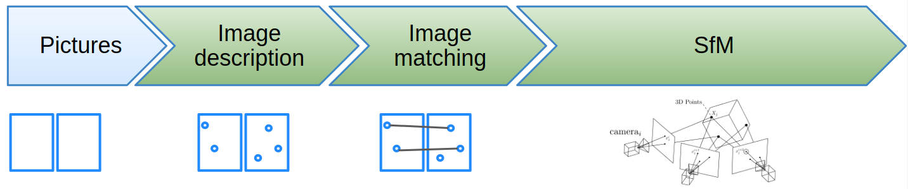

OpenMVG (open Multiple View Geometry)
=====================================

<p align="center">

<p/>

| **License** | **Documentation** | Continuous Integration (Linux/MacOs/Windows) |Build  | Code Quality | Chat |
|:-:|:-:|:-:|:-:|:-:|:-:|
| [](https://github.com/openMVG/openMVG/blob/master/LICENSE) |   [](http://openmvg.readthedocs.org/en/latest) <br> [Wiki](https://github.com/openMVG/openMVG/wiki) | [](https://github.com/openMVG/openMVG/actions/workflows/compile_and_run_test.yml) | [local/docker build tutorial ](https://github.com/openMVG/openMVG/blob/master/BUILD.md)|  [](https://github.com/openMVG/openMVG/actions/workflows/codeql.yml) <br> [](https://www.codefactor.io/repository/github/openmvg/openmvg) | [](https://gitter.im/openMVG/Lobby) |

**Our Mission**
- Extend awareness of the power of 3D reconstruction from images/photogrammetry by developing a C++ framework.

**Our Vision**
- Simplify reproducible research with easy-to-read and accurate implementation of state of the art and "classic" algorithms.

**Our Credo**
- "Keep it simple, keep it maintainable".
  - OpenMVG is designed to be easy to read, learn, modify and use.
  - Thanks to its strict test-driven development and samples, the library allows to build trusted larger systems.

**Our codebase and pipeline**

OpenMVG provides an end-to-end 3D reconstruction from images framework compounded of libraries, binaries, and pipelines.
- **The libraries** provide easy access to features like: images manipulation, features description and matching, feature tracking, camera models, multiple-view-geometry, robust-estimation, structure-from-motion algorithms, ...
- **The binaries** solve unit tasks that a pipeline could require: scene initialization, feature detection & matching and structure-from-motion reconstruction, export the reconstructed scene to others Multiple-View-Stereovision framework to compute dense point clouds or textured meshes.
- **The pipelines** are created by chaining various binaries to compute image matching relation, solve the Structure from Motion problem (reconstruction, triangulation, localization) and ...

OpenMVG is developed in C++ and runs on Android, iOS, Linux, macOS, and Windows.

<p align="center">

<p/>

**Tutorials**
- See [Wiki](https://github.com/openMVG/openMVG/wiki)
  - [OpenMVG Data Structure](https://github.com/openMVG/openMVG/wiki/OpenMVG-data-structures)
  - [Using OpenMVG as a library](https://github.com/openMVG/openMVG/blob/develop/BUILD.md#using-openmvg-as-a-third-party-library-dependency-with-cmake)
  - [Using OpenMVG on your image dataset](https://github.com/openMVG/openMVG/wiki/OpenMVG-on-your-image-dataset)
  - ...

**More information**
- [Authors](#authors)
- [Contact](#contact)
- [Citations](#citations)
- [Acknowledgements](#acknowledgements)

## Authors

See [Authors](https://github.com/openMVG/openMVG/raw/master/AUTHORS) text file

## Contact

openmvg-team[AT]googlegroups.com


## Citations

We are recommending citing `OpenMVG` if you are using the whole library or the adequate paper if you use only a submodule `AContrario Ransac [3], AContrario
SfM [1], GlobalSfM [4] or Tracks [2]`:

```
@inproceedings{moulon2016openmvg,
  title={Open{MVG}: Open multiple view geometry},
  author={Moulon, Pierre and Monasse, Pascal and Perrot, Romuald and Marlet, Renaud},
  booktitle={International Workshop on Reproducible Research in Pattern Recognition},
  pages={60--74},
  year={2016},
  organization={Springer}
}
```

[1] Moulon Pierre, Monasse Pascal and Marlet Renaud. ACCV 2012.
[Adaptive Structure from Motion with a contrario model estimation.](http://hal.archives-ouvertes.fr/index.php?halsid=1n2qdqiv2a0l5eq7qpos9us752&view_this_doc=hal-00769266&version=1)
```
@inproceedings{Moulon2012,
  doi = {10.1007/978-3-642-37447-0_20},
  year  = {2012},
  publisher = {Springer Berlin Heidelberg},
  pages = {257--270},
  author = {Pierre Moulon and Pascal Monasse and Renaud Marlet},
  title = {Adaptive Structure from Motion with a~Contrario Model Estimation},
  booktitle = {Proceedings of the Asian Computer Vision Conference (ACCV 2012)}
}
```

[2] Moulon Pierre and Monasse Pascal. CVMP 2012.
[Unordered feature tracking made fast and easy.](http://hal.archives-ouvertes.fr/index.php?halsid=ggdarhl8cv1j6ohq2073eok8q3&view_this_doc=hal-00769267&version=1)
```
@inproceedings{moulon2012unordered,
  title={Unordered feature tracking made fast and easy},
  author={Moulon, Pierre and Monasse, Pascal},
  booktitle={CVMP 2012},
  pages={1},
  year={2012}
}
```

[3] Moisan Lionel, Moulon Pierre and Monasse Pascal. IPOL 2012.
[Automatic Homographic Registration of a Pair of Images, with A Contrario Elimination of Outliers.](http://dx.doi.org/10.5201/ipol.2012.mmm-oh)
```
@article{moisan2012automatic,
  title={Automatic homographic registration of a pair of images, with a contrario elimination of outliers},
  author={Moisan, Lionel and Moulon, Pierre and Monasse, Pascal},
  journal={Image Processing On Line},
  volume={2},
  pages={56--73},
  year={2012}
}
```

[4] Moulon Pierre, Monasse Pascal, and Marlet Renaud. ICCV 2013.
[Global Fusion of Relative Motions for Robust, Accurate and Scalable Structure from Motion.](http://imagine.enpc.fr/~moulonp/publis/iccv2013/index.html)

```
@inproceedings{moulon2013global,
  title={Global fusion of relative motions for robust, accurate and scalable structure from motion},
  author={Moulon, Pierre and Monasse, Pascal and Marlet, Renaud},
  booktitle={Proceedings of the IEEE International Conference on Computer Vision},
  pages={3248--3255},
  year={2013}
}
```

## Acknowledgements

openMVG authors would like to thanks libmv authors for providing an inspiring
base to design openMVG. Authors also would like to thanks [Mikros Image](http://www.mikrosimage.eu/)
and [LIGM-Imagine laboratory](http://imagine.enpc.fr/) for support and authorization to make this
library an opensource project.
