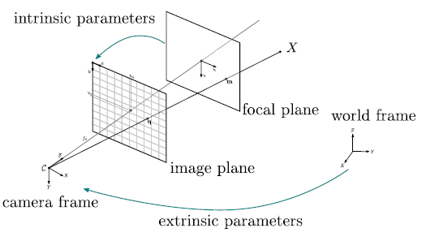

*******************
cameras
*******************

This module provides different camera models.

Pinhole camera model 
=====================

A camera could be approximated by a projective model, often called pinhole projection.
The simplest representation of a camera is a light sensible surface (sensor): an image plane, a lens
(projective projection) at a given position and orientation in space.

   
   The pinhole camera model. An oriented central projective camera.

The pinhole camera geometry models the projective camera with two sub-parametrizations,
intrinsic and extrinsic parameters.
Intrinsic parameters model the optic component (without distortion) and extrinsic model the camera position and orientation in space.
This projection of the camera is described as:

.. math::
  P_{3 \times 4} = K [R|t] = 
  \begin{bmatrix}
  f*k_u &  & c_u \\
   & f*k_v & c_v \\
   &  & 1
  \end{bmatrix}
  \begin{bmatrix}
   &  &  & t_x \\
   & R_{3 \times 3} &  & t_y \\
    &  &  & t_z \\
    0 & 0 & 0 & 1\\
  \end{bmatrix}

- Intrinsic parameters :math:`[f; cu; cv]:` 

  * :math:`ku, kv :` scale factor relating pixels to distance (often equal to 1),
  * :math:`f :` the focal distance (distance between focal and image plane),
  * :math:`cu, cv :` the principal point, which would be ideally in the centre of the image.

- Extrinsic parameters :math:`[R|t] = [R| - RC]:`

  * :math:`R :` the rotation of the camera to the world frame,
  * :math:`t :` the translation of the camera. t is not the position of the camera. It is the position of the origin of the world coordinate system expressed in coordinates of the camera-centred coordinate system. The position, :math:`C`, of the camera expressed in world coordinates is :math:`C=-R^{-1} t = -R^T t` (since R is a rotation matrix).

A 3D point is projected in a image with the following formula (homogeneous coordinates):

.. math:: x_i = PX_i = K[R|t]X_i

.. math::
  \begin{bmatrix}
  u_i\\
  v_i\\
  w_i\\
  \end{bmatrix} =
  \begin{bmatrix}
  f*k_u &  & c_u \\
   & f*k_v & c_v \\
   &  & 1\\
  \end{bmatrix}
  \begin{bmatrix}
   &  &  & t_x \\
   & R_{3 \times 3} &  & t_y \\
   &  &  & t_z \\
   0 & 0 & 0 & 1\\
  \end{bmatrix}
  \begin{bmatrix}
  X_i\\
  Y_i\\
  Z_i\\
  W_i\\
  \end{bmatrix}

OpenMVG Pinhole camera models
------------------------------

* Pinhole intrinsic

  * :class:`Pinhole_Intrinsic : public IntrinsicBase` 

    * classic pinhole camera (Focal + principal point and image size).

  * :class:`Pinhole_Intrinsic_Radial_K1 : public Pinhole_Intrinsic`

    * classic pinhole camera (Focal + principal point and image size) + radial distortion defined by one factor.
    * can add and remove distortion

  * :class:`Pinhole_Intrinsic_Radial_K3 : public Pinhole_Intrinsic`

    * classic pinhole camera (Focal + principal point and image size) + radial distortion by three factors.
    * can add and remove distortion
    
  * :class:`Pinhole_Intrinsic_Brown_T2 : public Pinhole_Intrinsic`
  
    * classic pinhole camera (Focal + principal point and image size) + radial distortion by three factors + tangential distortion by two factors.
    * can add and remove distortion

* Simple pinhole camera models (intrinsic + extrinsic(pose))

.. code-block:: c++ 

  // Setup a simple pinhole camera at origin
  // Pinhole camera P = K[R|t], t = -RC
  Mat3 K;
  K << 1000, 0, 500,
       0, 1000, 500,
       0, 0, 1;
  PinholeCamera cam(K, Mat3::Identity(), Vec3::Zero());
