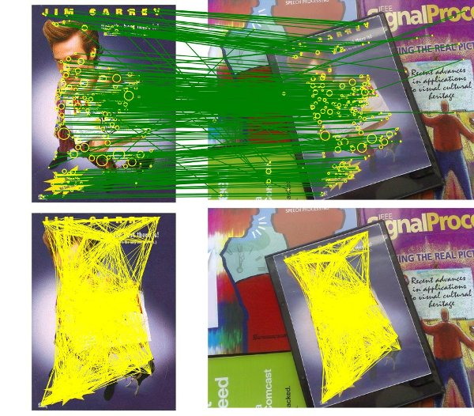

*******************
matching
*******************

Method
=============

A generic interface to perform the **Nearest neighbor search (NNS)** and **K-Nearest Neighbor (K-NN)** search.

Two methods can be used:

* Brute force,
* Approximate Nearest Neighbor [FLANN]_.

This module works for any size of data, it could be use to match:

* 2 or 3 vector long features (points),
* 128, 64, vector long features (like SIFT, SURF descriptors).

Using the **Nearest neighbor search (NNS)** let you find pairs of elements (``(i,j)``) from sets ``A`` and ``B`` that are the closest for a given metric ``d``:

.. math::

  \lbrace (P^i_A,P^j_B): j = \underset{k} {\mathrm{argmin}} \quad d(\text{desc}(P^i_A), \text{desc}(P^k_B)) \rbrace
  
Using the **K-NN** will return you tuple of elements: ``(i;(j,k))`` if 2 nearest values have been asked for the Inth query.

Example of usage:

.. code-block:: c++

  // Setup the matcher 
  ArrayMatcherBruteForce<float> matcher;
  // The reference array
  float array[] = {0, 1, 2, 3, 4};
  // Setup the reference array of the matcher 
  matcher.Build(array, 5, 1);

  //--
  // Looking for the nearest neighbor:
  //--
  // Perform a query to look which point is closest to 1.8
  float query[] = {1.8f};
  int nIndice = -1;
  float fDistance = -1.0f;
  matcher.SearchNeighbour(query, &nIndice, &fDistance);

  //  nIndice == 2 ; // index of the found nearest neighbor
  //  fDistance == 0.4; // squared distance

  //--
  // Looking for the K=2 nearest neighbor
  //--
  vector<int> vec_nIndice;
  vector<float> vec_fDistance;
  const int K = 2;
  matcher.SearchNeighbours(query, 1, &vec_nIndice, &vec_fDistance, K);
  
  // vec_nIndice = {2,1};

  
Metric
=============

Used metric is customizable and enable matching under:

* L2 (used by default):

.. math::
  d(x,y):=\| x-y \|_2

* or an user customized distance (L1, ...),

* i.e L1 for binary descriptor (Hamming distance)

.. math::
  d(x,y) = \sum(x \oplus y)

Filtering
=============

When used with descriptors found putatives matches can be filtered thanks to different filters:

* Symmetric distance (Left-Right check).

  * Keep only mutal correspondences: a match is kept if it is the same in the A->B and B->A order.
    
.. math::
  \lbrace (P^i_A,P^j_B): j = \underset{k} {\mathrm{argmin}} ~ d(\text{desc}(P^i_A), \text{desc}(P^k_B)), i = \underset{k} \min ~ d(\text{desc}(P^k_A), \text{desc}(P^j_B))
  \rbrace

* "Nearest Neighbor Distance Ratio" distance check can be performed to remove repetitive elements.

  * As many nearest points have been asked we can measure the similarity between the N-nearest neighbor. If the ratio of distance is inferior to a threshold ``\delta`` the match is kept else it is rejected (since the risk of confusion is higher). It allows to avoid ambiguous correspondences. ``\delta`` is often choosen between ``0.6`` and ``0.8``.
    
.. math::
  \lbrace (P^i_A,P^j_B): j = \underset{k} {\mathrm{argmin}} ~ d(\text{desc}(P^i_A), \text{desc}(P^k_B)) < \delta \underset{k\neq j} \min ~ d(\text{desc}(P^i_A), \text{desc}(P^k_B))
  \rbrace

* K-VLD Filter (K-Virtual Line Descriptor) [KVLD12]_

  * A virtual segment (a segment/line between two points) is kept if at least one of it's supporting point is linked to K virtual segments. It produces a coherent photometric graph of the features from the set of points ``A`` and ``B``. Below: Top (SIFT putative matches found by NNS), Bottom: K-VLD coherent matches.
  

