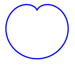

*******************
Vector drawing
*******************

openMVG considers that visualizing data is important. OpenMVG provides a class that help to perform vector graphics (SVG) drawing in order to have the best possible visualization of his algorithm output. Vector graphics allows keeping details when you zoom what is not done when you use raster graphics. (SVG files are supported by web navigator and the Inkscape software). 

.. code-block:: c++

	// Draw a cardiod curve with the svg polyline
	// http://en.wikipedia.org/wiki/Cardioid
	{ // Pre-compute (x, y ) curve points
		size_t nbPoints = 120 ;
		std::vector<float> vec_x ( nbPoints, 0.f ), vec_y ( nbPoints, 0.f );
		doubleS = 20.;
		for ( size_t i = 0; i < nbPoints; ++i ) {
			const double theta = i*2*M_PI/nbPoints;
			//-- Cardioid equation
			vec_x[i] = (3*S+S*(2.*sin(theta)-(sin(2.*theta))));
			vec_y[i] = (2*S-S*(2.*cos(theta)-(cos(2.*theta))));
		}
		// Create a svg surface and add the cardiod polyline
		svgDrawer svgSurface (6 *S, 6 *S); //Create a svg object
		svgSurface.drawPolyline (
			vec_x.begin( ) , vec_x.end( ),
			vec_y.begin( ) , vec_y.end( ),
			svgStyle( ).stroke( "blue", 2));

		//Export the SVG stream to a file
		std::string sFileName = "ThirdExample.svg";
		std::ofstream svgFile ( sFileName.c_str( ));
		svgFile << svgSurface.closeSvgFile( ).str( );
		svgFile.close( );
	}
	
Here the result exported vector graphic:

