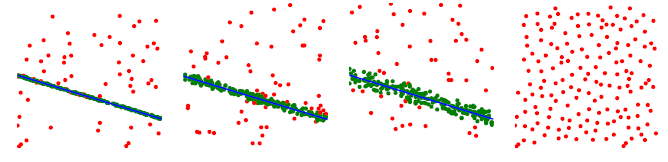

**************************
robust_estimation
**************************

Performing model estimation is not an easy task, data are always corrupted by noise and "false/outlier" data so robust estimation is required to find the "best" model along the possible ones.

.. figure:: robustEstimation.png
   :align: center

   Robust estimation: Looking for a line in corrupted data.

openMVG provides many methods to estimate one of the best possible model in corrupted data:

- Max-Consensus,
- Ransac,
- LMeds,
- AC-Ransac (A Contrario Ransac).

Max-Consensus
====================

The idea of Max-Consensus is to use a random picked subset of data to find a model and test if
this model is good or not the whole dataset. At the end you keep the model that best fits your cost
function. Best fit defined as the number of data correspondences to the model under your specified
threshold T.

Algorithm 1 Max-Consensus

.. code-block:: c++

	Require: correspondences
	Require: model solver, residual error computation
	Require: T threshold for inlier/outlier discrimination
	Require: maxIter the number of performed model estimation
	Ensure: inlier list
	Ensure: best estimated model Mbest
		for i = 0 ! maxIter do
			Pick NSample random samples
			Evaluate the model Mi for the random samples
			Compute residuals for the estimated model
			if Cardinal(residual < T) > previousInlierCount then
				previousInlierCount = Cardinal(residual < T)
				Mbest = Mi
			end if
		end for

Here an example of how find a best fit line:

.. code-block:: c++

	Mat2X xy ( 2 , 5);
	// Defines some data points
	xy << 1, 2, 3, 4,  5, // x
	      3, 5, 7, 9, 11; // y

	// The base model estimator and associated error metric
	LineKernel kernel ( xy );

	// Call the Max-Consensus routine
	std::vector<uint32_t> vec_inliers;
	Vec2 model = MaxConsensus ( kernel , ScorerEvaluator<LineKernel >(0.3) , &-vec_inliers );

Ransac
====================

Ransac [RANSAC]_ is an evolution of Max-Consensus with a-priori information about the noise and corrupted
data amount of the data. That information allows to reduce the number of iterations in order to be
sure to have made sufficient random sampling steps in order to find the model for the given data
confidence. The number of remaining steps is so iteratively updated given the inlier/outlier ratio of
the current found model.

Here an example of how find a best fit line:

.. code-block:: c++

	Mat2X xy ( 2 , 5);
	// Defines some data points
	xy << 1, 2, 3, 4,  5, // x
	      3, 5, 7, 9, 11; // y

	// The base model estimator and associated error metric
	LineKernel kernel ( xy );

	// Call the Ransac routine
	std::vector<uint32_t> vec_inliers;
	Vec2 model = Ransac ( kernel, ScorerEvaluator<LineKernel >(0.3) , &vec_inliers );

AC-Ransac A Contrario Ransac
================================

RANSAC requires the choice of a threshold T, which must be balanced:

- Too small: Too few inliers, leading to model imprecision,
- Too large: Models are contaminated by outliers (false data).

AC-Ransac [ACRANSAC]_ uses the a contrario methodology in order to find a model that best fits the
data with a confidence threshold T that adapts automatically to noise. It so finds a model and its
associated noise. If there is too much noise, the a contrario method returns that no model was
found.

   A contrario robust estimation, noise adaptivity.

Here an example of how to find a best fit line, by using the a contrario robust estimation framework:
It is a bit more complex, we use a class in order to perform the a contrario required task.

.. code-block:: c++

	Mat2X xy ( 2 , 5);
	// Defines some data points
	xy << 1, 2, 3, 4,  5, // x
	      3, 5, 7, 9, 11; // y

	// The acontrario adapted base model estimator and associated error metric
	const size_t img_width = 12;
	ACRANSACOneViewKernel<LineSolver, pointToLineError, Vec2> lineKernel(xy,  -img_width, img_width);

	// Call the AC-Ransac routine
	std::vector<uint32_t> vec_inliers;
	Vec2 line;
	std::pair<double, double> res = ACRANSAC(lineKernel, vec_inliers, 300, &line);
	double dPrecision = res.first;
	double dNfa = res.second;

