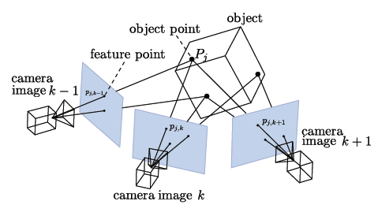

*************************
sfm
*************************

sfm is the module related to Structure from Motion.
It handles storage of SfM related data and method to solve SfM problems (camera pose estimation, structure triangulation, bundle_adjustment).

A generic SfM data container
=============================

:class:`SfM_Data` class contains all the data used to describe input of a SfM problem:

* a collection of **View**

  * the used images

* a collection of **camera extrinsic**

  * the camera poses

* a collection of **camera intrinsic**

  * the camera internal projection parameters

* a **structure**

  * the collection of landmark (3D points associated with 2d view observations)

.. code-block:: c++

  struct SfM_Data
  {
    /// Considered views
    Views views;

    /// Considered poses (indexed by view.id_pose)
    Poses poses;

    /// Considered camera intrinsics (indexed by view.id_cam)
    Intrinsics intrinsics;

    /// Structure (3D points with their 2D observations)
    Landmarks structure;

    // ...
  }

View concept
--------------

The view store information related to an image:

* image filename
* id_view (must be unique)
* id_pose
* id_intrinsic
* image size

Note that thanks to the usage of ids we can defined shared poses & shared intrinsics.

View type is **abstract** and provide a way to add new custom View type: i.e. GeoLocatedView (add GPS position, ...)

Camera Poses concept
---------------------

The camera pose store a 3D pose that define a camera rotation and position (camera rotation and center).

Camera Intrinsic concept
--------------------------

Define the parameter of a camera. It can be shared or not.
Intrinsics parameter are **abstract** and provide a way to easily add new custom camera type.

Structure/Landmarks concept
----------------------------

It defines the structure:

* 3D point with 2D view features observations.

SfM_Data cleaning
==================

Generic interface are defined to remove outlier observations:

* use a given residual pixel error to discard outlier,
* use a minimal angle along the track bearing vectors.

Triangulation
==================

Once the SfM_Data is filled with some landmark observations and poses we can compute their 3D location.

Two method are proposed:

* A blind method:

  * Triangulate tracks using all observations,

  * Inlier/Outlier classification is done with a cheirality test,

* A robust method:

  * Triangulate tracks using a RANSAC scheme,

  * Check cheirality and a pixel residual error.

Non linear refinement, Bundle Adjustment
==========================================

OpenMVG provides a generic bundle_adjustment framework to refine or keep as constant the following parameters:

* internal orientation parameters (intrinsics: camera projection model),
* external orientation parameters (extrinsics: camera poses),
* structure (3D points).

.. code-block:: c++

  SfM_Data sfm_data;
  // initialize the data
  // ...

  const double dResidual_before = RMSE(sfm_data);

  // Bundle adjustement over all the parameters:
  std::shared_ptr<Bundle_Adjustment> ba_object = std::make_shared<Bundle_Adjustment_Ceres>();
  ba_object->Adjust(sfm_data);

  const double dResidual_after = RMSE(sfm_data);

Bundle Adjustment (ajustement de faisceaux), is a non linear optimization problem.
It looks to minimizing the residual error of a series of user cost functions (the reprojection errors of the structure :math:`X_j` to the images measures :math:`x_j^i`).
According:

* :math:`X_j` the Jnth 3D point of the structure of the scene,
* :math:`x_j^i` the observation of the projection of the 3D point :math:`X_j` in the image :math:`i`,
* :math:`P_i` the projection matrix of the image :math:`i`

From a user provided initial guess the vector of parameters: :math:`\{X_j,P_i\}_{i,j}`: camera parameters :math:`\{P_i\}_i` and the scene structure :math:`\{X_j\}_j` are refined in order to minimizes the residual reprojection cost:

.. math::
  \underset{ \{P_i\}_i, \{X_j\}_j}{minimize} \left\| \sum_{j=0}^{m} \sum_{i=0}^{n} x_j^i - P_i X_j \right\|_2

OpenMVG proposes options in order to tell if a parameter group must be kept as constant or refined during the minimization.

SfM Pipelines
==============

OpenMVG provides ready to use and customizable pipelines for:

* solving sequential/incremental SfM,
* solving global SfM,
* computing a Structure from known camera poses.

   Figure: From point observation and intrinsic camera parameters, the 3D **structure** of the scene is computed **from** the estimated **motion** of the camera.

Sequential SfM
-------------------------

The [ACSfM]_ SfM is based on the implementation used for the paper "Adaptive Structure from Motion with a contrario model estimation"  published at ACCV 2012.

The incremental pipeline is a growing reconstruction process.
It starts from an initial two-view reconstruction (the seed) that is iteratively extended by adding new views and 3D points, using pose estimation and triangulation.
Due to the incremental nature of the process, successive steps of non-linear refinement, like Bundle Adjustment (BA), are performed to minimize the accumulated error (drift).

Incremental Structure from Motion

.. code-block:: c++

  Require: internal camera calibration (possibly from EXIF data)
  Require: pairwise geometry consistent point correspondences
  Ensure: 3D point cloud
  Ensure: camera poses
  compute correspondence tracks t
  compute connectivity graph G (1 node per view, 1 edge when enough matches)
  pick an edge e in G with sufficient baseline
  * robustly estimate essential matrix from images of e
  triangulate validated tracks, which provides an initial reconstruction
  contract edge e
  while G contains an edge do
    pick edge e in G that maximizes union(track(e),3D points)
    * robustly estimate pose (external orientation/resection)
    triangulate new tracks
    contract edge e
    perform bundle adjustment
  end while

Steps marked by a * are robust estimation performed using the a-contrario robust estimation framework.

Global SfM
-------------------------

[GlobalACSfM]_ is based on the paper "Global Fusion of Relative Motions for Robust, Accurate and Scalable Structure from Motion."  published at ICCV 2013.

Multi-view structure from motion (SfM) estimates the position and orientation of pictures in a common 3D coordinate frame. When views are treated incrementally, this external calibration can be subject to drift, contrary to global methods that distribute residual errors evenly. Here the method propose a new global calibration approach based on the fusion of relative motions between image pairs. 

.. code-block:: c++

  Require: internal camera calibration (possibly from EXIF data)
  Require: pairwise geometry consistent point correspondences
  Ensure: 3D point cloud
  Ensure: camera poses

  compute relative pairwise rotations
  detect and remove false relative pairwise rotations
    - using composition error of triplet of relative rotations
  compute the global rotation
    - using a least square and approximated rotations
  compute relative translations
    - using triplet of views for stability and colinear motion support
  compute the global translation
    - integration of the relative translation directions using a l-∞ method
  final structure and motion
    - link tracks validated per triplets and compute global structure by triangulation
    - refine estimated parameters in a 3 step Bundle Adjustment
      - refine structure and translations
      - refine structure and camera parameters (rotations, translations)
      - refine if asked intrinsics parameters

Structure computation from known camera poses
----------------------------------------------

This class allows to compute valid 3D triangulation from 2D matches and known camera poses.

.. code-block:: c++

  Require: internal and external camera calibration
  Require: features and corresponding descriptor per image view
  Ensure: 3D point cloud

  initialize putatives matches pair from
    - a provided pair file
    - or automatic pair computed from camera frustum intersection
  for each pair
    - find valid epipolar correspondences
  for triplets of view
    - filter 3-view correspondences that leads to invalid triangulation
  merge 3-view validated correspondences
    - robustly triangulate them 
  save the scene with the update structure
