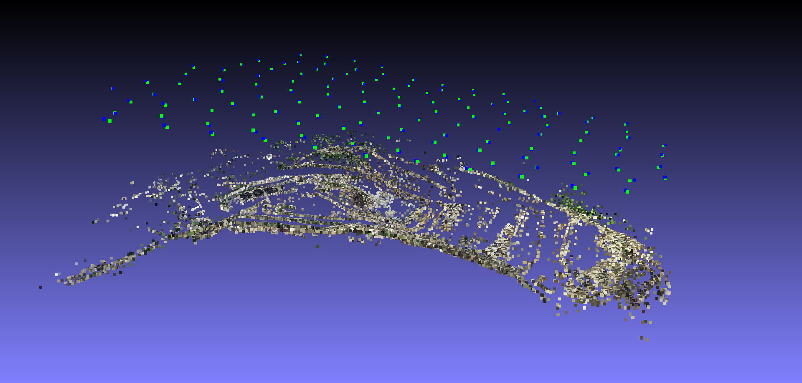

********************************************
Geodesy: Usage of GPS prior
********************************************

.. contents:: :depth: 2

Introduction
============

In order to compute scene in the user coordinates system, the user can use some Geodesy data (i.e GPS or XYZ prior).

Those informations can be used in two ways in OpenMVG:

To speed up the pairwise feature matching step:

  - limit the number of pair by matching only neighbor images.

For SfM:

  - As rigid prior,
  - As non rigid prior.

Usage of pose prior
====================

To speed up the pairwise feature matching step
----------------------------------------------

  .. code-block:: c++

    $ openMVG_main_ListMatchingPairs -G -n 5 -i Dataset/matching/sfm_data.bin -o Dataset/matching/pair_list.txt

**Required parameters:**

 - **[-i|--input_file]** The input SfM_Data file (must have pose prior see "Scene initialization" below)

  - **[-o|--output_file]** The pair list filename (will be send to main_ComputeMatches to limit the number of pairs)

**Enable the neighboring view limitation**

  - **[-G|--gps_mode]** Enable the computation of GPS neighborhood

  - **[-n|--neighbor_count]** The number of maximum neighbor per poses (list the N closest poses GPS corresponding XYZ positions.)

For SfM to XYZ (GPS) registration
==================================

Rigid Registration [SfM]
------------------------

Once you have performed SfM on your scene, you can adjust your scene coordinate system to fit your GPS datum.
A 7DoF similarity can be computed between the SfM camera center position & the image GPS datum.
The found similarity is applied to Camera position & landmarks.

Note: GPS conversion to XYZ Image position is computed in ECEF by using valid WGS84 GPS latitude, longitude & altitude EXIF data.

  .. code-block:: c++

    $ openMVG_main_geodesy_registration_to_gps_position -i Dataset/out_Reconstruction/sfm_data.bin -o Dataset/out_Reconstruction/sfm_data_adjusted.bin

Arguments description:

**Required parameters:**

  - **[-i|--input_file]**

    - a SfM_Data file with valid intrinsics and poses and optional structure

  - **[-o|--output_file]**

    - filename in which the registered SfM_Data scene must be saved

**Optional parameters:**

  - **[-m|--method]** method that will be used to compute the GPS registration

    - 0: Registration is done by using a robust estimation (Minimization of the Median fitting error).

    - 1(default): Registration is done using all corresponding points.

Non-Rigid Registration (adaptive registration) [SfM]
-----------------------------------------------------

Pose prior (GPS/Odometry) can be use as a non rigid prior during OpenMVG SfM Bundle Adjustment phase.
To do so, XYZ pose prior must be set in the initial SfM_Data file and the usage of prior must be set in the SfM binaries.

Here the command line change that you must notice in order to use the GPS prior data.

- First you must initialize the scene with XYZ view's pose prior.
- Then you must tell to the SfM pipeline to use the pose prior data.

Scene initialization
~~~~~~~~~~~~~~~~~~~~~

  .. code-block:: c++
  
    $ openMVG_main_SfMInit_ImageListing -P [other args]

**Optional parameters:**

  - **[-P]**

    - Setup a XYZ position prior for each view that have valid EXIF GPS data.

  - **[-w]**

    - Allow to customize the pose prior weight in each XYZ dimention i.e. default is equivalent to "1.0;1.0;1.0"

Force pose prior usage
~~~~~~~~~~~~~~~~~~~~~~

  .. code-block:: c++
  
    $ openMVG_main_IncrementalSfM -P [other args]
    $ openMVG_main_GlobalSfM -P [other args]

**Optional parameters:**

  - **[-P]**

    - Enable the usage of view's motion priors data.

Use-case: command line used for a flat UAV survey
====================================================

Launched on the dataset Swiss Quarry `Geotagged multispectral images <http://chuqavct.preview.infomaniak.com/postflight-examples/06-mining-quarry-switzerland/geotagged-images.zip>`_.

  .. code-block:: c++

    // Initialize the scene
    //  Pose prior for each view will be set thanks to the GPS data
    openMVG_main_SfMInit_ImageListing \
      -P \
      -d sensor_width_camera_database.txt \
      -i /media/pierre/SenseFly/Quarry/geotagged-images/ \
      -o /media/pierre/SenseFly/Quarry/quary_output/

    thread_count=8
    openMVG_main_ComputeFeatures \
      -i /media/pierre/SenseFly/Quarry/quary_output/sfm_data.json \
      -o /media/pierre/SenseFly/Quarry/quary_output/matches \
      -n $thread_count

    // Limit the number of pairs that will be used for matching
    // -> limit to pose neighborhood thanks to the pose center prior location
    openMVG_main_ListMatchingPairs \
      -G \
      -n 8 \
      -i /media/pierre/SenseFly/Quarry/quary_output/sfm_data.json \
      -o /media/pierre/SenseFly/Quarry/quary_output/matches/pair_list.txt

    openMVG_main_ComputeMatches \
      -i /media/pierre/SenseFly/Quarry/quary_output/sfm_data.json \
      -l /media/pierre/SenseFly/Quarry/quary_output/matches/pair_list.txt \
      -g e \
      -o /media/pierre/SenseFly/Quarry/quary_output/matches/

    openMVG_main_GlobalSfM \
      -P \
      -i /media/pierre/SenseFly/Quarry/quary_output/sfm_data.json \
      -m /media/pierre/SenseFly/Quarry/quary_output/matches/ \
      -o /media/pierre/SenseFly/Quarry/quary_output/global_reconstruction

Here the final results:

In green the SFM poses, and in blue the GPS Exif ECEF poses. We clearly see that the two coordinates system are close.

