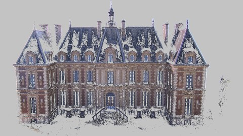

**********************************
Export to Colmap
**********************************

OpenMVG exports to Colmap's [Schoeneberger2016]_ SfM model format. 

Once a sparse reconstruction has been computed you can convert OpenMVG's SfM ouput to Colmap's model format using openMVG_main_openMVG2Colmap:

.. code-block:: c++

  $ openMVG_main_openMVG2Colmap -i Dataset/OpenMVGSfM/sfm_data.bin -o Dataset/ColmapSfM/model

This will create the following files in Dataset/ColmapSfM/model:

.. code-block:: text

    model/
    ├-cameras.txt
    ├-images.txt
    ├-points3D.txt

Note: Colmap supports OpenMVG's PINHOLE_CAMERA and PINHOLE_CAMERA_RADIAL1 camera models, only.

To apply Colmap's MVS pipeline:

.. code-block:: c++

  $ colmap image_undistorter --image_path Dataset/images --input_path Dataset/ColmapSfM/model --output_path Dataset/ColmapMVS
  $ colmap dense_stereo --workspace_path Dataset/ColmapMVS
  $ colmap dense_fuser --workspace_path Dataset/ColmapMVS

   Figure: Multiple View Stereo result using [Schoeneberger2016]_.

   