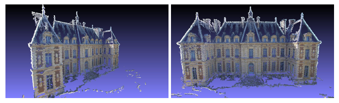

*************************************
Multiple View Stereovision
*************************************

Once camera position and orientation have been computed, Multiple View Stereo-vision algorithms could be used 
to compute a dense scene representation, such as:

- dense point cloud,
- surface and texture.

Export to PMVS/CMVS
========================

OpenMVG exports [PMVS]_ ready to use project (images, projection matrices and pmvs_options.txt files).

Once a 3D calibration have been computed you can convert the SfM_Ouput files to a PMVS project.

.. code-block:: c++

  $ openMVG_main_openMVG2PMVS -i Dataset/outReconstruction/SfM_Output/ -o Dataset/outReconstruction/SfM_Output/
  $ pmvs Dataset/outReconstruction/SfM_Output/PMVS/ pmvs_options.txt

   Figure: Multiple View Stereo-vision point cloud densification on the estimated scene using [PMVS]_.

In order to use CMVS for large scene openMVG2PMVS export also the scene in the Bundler output format.

.. code-block:: c++

  $ openMVG_main_openMVG2PMVS -i Dataset/outReconstruction/SfM_Output/ -o Dataset/outReconstruction/SfM_Output/
  $ cmvs Dataset/outReconstruction/SfM_Output/PMVS/ [MaxImageCountByCluster=100]
  $ cmvs Dataset/outReconstruction/SfM_Output/PMVS/ 30
  $ genOption Dataset/outReconstruction/SfM_Output/PMVS/
  $ sh Dataset/outReconstruction/SfM_Output/PMVS/pmvs.sh

Export to CMPMVS
========================

OpenMVG exports [CMPMVS]_ ready to use project (images, projection matrices and ini configuration file).

.. code-block:: c++

  $ openMVG_main_openMVG2CMPMVS -i Dataset/outReconstruction/SfM_Output/ -o Dataset/outReconstruction/SfM_Output/

