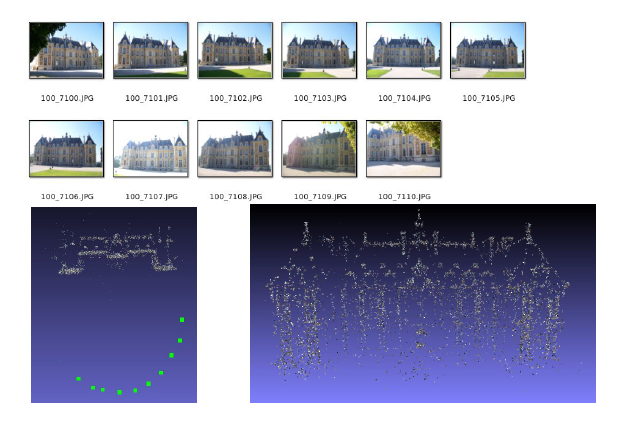

***************************
SfM: Structure-from-Motion
***************************

Structure from Motion computes an external camera pose per image (the motion) and a 3D point cloud (the structure) representing the pictured scene.
Inputs are images and internal camera calibration information (intrinsic parameters).
Feature points are detected in each image (e.g., SIFT) and matched between image pairs and then the SfM pipeline compute the scene and camera motion.
There are three main approaches to solve the SfM problem:

  - the incremental/sequential pipeline,
  - the hierarchical pipeline,
  - the global one.

.. figure:: structureFromMotion.png
   :align: center

   Figure: From point observation and internal knowledge of camera parameter, the 3D **structure** of the scene is computed **from** the estimated **motion** of the camera.

In a nutshell
===================

From an image sequence and an approximated focal length it is possible to compute the following:

   
   Figure : Input images, estimated camera location and structure.

openMVG tools
====================

  - 2 **Structure from Motion pipeline**:

    - an Incremental Structure from Motion chain [ACSfM]_ (ACCV 2012),
    - a Global Structure from Motion chain [GlobalACSfM]_ (ICCV 2013).

  - **tools** to visualize:

    - features,
    - photometric/geometric matches correspondences,
    - features tracks.

  - **export to existing Multiple View Stereo-vision pipeline**:

    - [PMVS]_, CMPMVS.

  - **tools to build your own SfM pipeline**:

    - geometric solvers, robust estimators ...

To know more about each tool visit the following link and read the doc below:

.. toctree::
   :maxdepth: 1

   ./intrinsicGroups.rst
   ./geometricMatches.rst
   ./incrementalSfM.rst
   ./globalSfM.rst
   ./SfM_OutputFormat.rst
   ./MVS.rst

Structure from Motion chains usage
=====================================

The Structure from Motion chains take as input an image collection.

Using a 3 directories based data organisation structure is suggested:

* **images**

  - your image sequence.

* **matches**

  * the image information (lists.txt), images points and matches information will be saved here.

* **outReconstruction**

  * directory where result and log of the 3D reconstruction will be exported.

