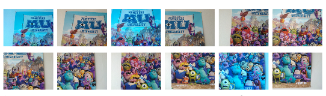
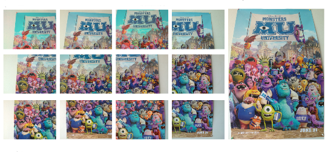
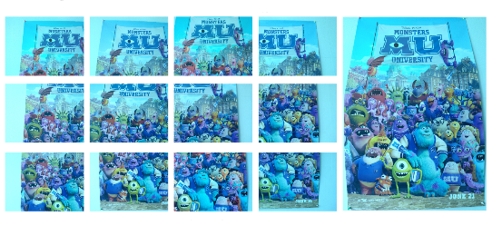

************************
Color Harmonization
************************

In a multiple-view image acquisition process, color consistency is not ensured.
This is an important problem for image fusion tasks: object texturing or mosaics blending for example.
In automatic mode, the camera adapts its settings --shutter-speed and aperture-- to the captured image content.
Therefore the color of objects changes over an image sequence.
  

In order to restore the color consistency, a transformation model between reference and observed colors have to be estimated.
It introduces two main problems:

* the data selection (common pixels between images),
* the estimation of a reliable color transformation between those pixels.

This module propose an interface to solve this problem:

[Moulon13]_ propose a global multi-view color consistency solution that in a first step selects robustly the common color information between images and in a second step estimates the color transformations that set all pictures in a common color reference, which involves a global minimization.
It uses a compact histogram representation of the shared color information per image pairs and solve the color consistency by using a linear program with a gain and offset model for each image.

A reference have to be choosen in order to set the color reference.

Here the obtained results on the image sequence after having choosen a "white" or "blue" image as reference:

   

