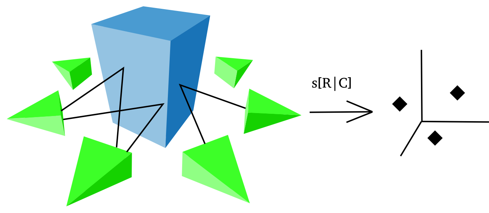

***********************************
Ground Control Points registration
***********************************

Structure from Motion find camera poses & a structure to an unknown scale of the real metric measure. In order to restore the correct scale and orientation to known 3D coordinates, OpenMVG provide a GUI to perform Ground Control Point registration.

- Given some 3D known ground control points and their 2D observations in some images, we can compute the rigid transformation to move the SfM scene to the known 3D coordinates. The rigid transformation (7Dof) is computed in least square between the triangulation of the observations and the known 3D positions).

- For your ground control points your can use specific pattern or object for which you known the measures (post-it, ruller, calibration target...).

   Figure : Ground Control Point registration principle illustration.

Short tutorial
====================

In this sample we scale the scene from the known dimensions of a paper target (see the post-it on the images below).

  - 1. Open your scene in the GUI
  
    - File/Open Project (CTRL+O) and open an sfm_data file.
    - double click on an image on the list to display it on the right
    - zoom level can be changed with CTRL+WHEEL
  
  .. figure:: gcp_gui.jpg
   :align: center
  
  - 2. Set your GCP observations positions whithin the images
  
    - choose your image,
    - click inside it (at the right position or not, you can move it later) & select your GCP unique ID,
    - then the Control point observation appears
    - to move your GCP click to it, and keep left mouse button clicked while moving it.

  .. figure:: gcp_edit_observation_positions.jpg
   :align: center
  .. figure:: gcp_edit_observation_positions_3pts.jpg
   :align: center

  - 3. Provide the 3D GCP known X,Y,Z positions

    - File/Control Point Edition (CTRL+E)
    - double click in the X,Y,Z cells and edit the 3D coordinates
    - close the window to save them
    
  .. figure:: gcp_edit_3Dposition.jpg
   :align: center

  - 4. Perform the registration

    - File/Control Point Registration (CTRL+R)
    - If at least 3D control points exist and iff their observations are triangulable, the registration will be performed and a report appears.

  .. figure:: gcp_registration.jpg
   :align: center

  - 5. Save your scene

    - File/Save Project (CTRL+S) and save your sfm_data file.
    - Post-process or use directly the point cloud to perform measures.
    - i.e here once MVS have been computed we can measure the eyes distance => ~= 5 cm

  .. figure:: gcp_measure_on_the_model.jpg
   :align: center

