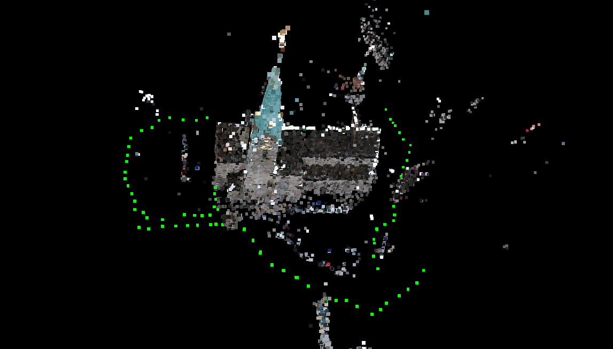
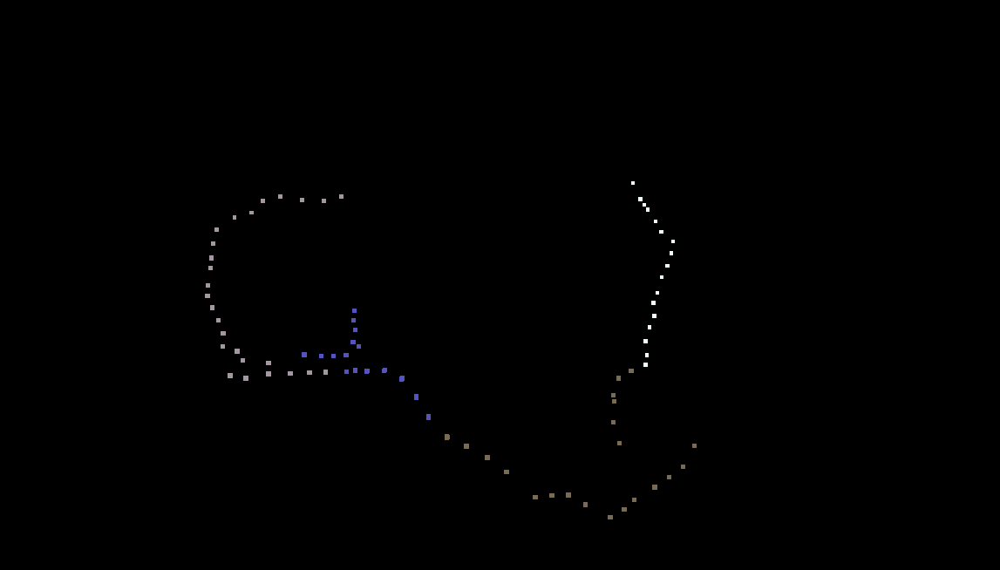

# Dominant Set Clustering algorithm

Clustering camera poses generated by a SFM pipeline such as openMVG. The library gives a list of view clusters.

The library is sfm application agnostic. It requires view poses and sparse point positions.
It uses affinity propogation to cluster poses.

This libary is an implementation of "Dominant set clustering" introduced by Maura, Massimo et al. at ETHZ Zurich Computer Vision Lab

## Source

Mauro, Massimo, et al. ["An integer linear programming model for view selection on overlapping camera clusters."](http://www.vision.ee.ethz.ch/~rhayko/paper/3dv2014_mauro_joint_selection_clustering.pdf)
2014 2nd International Conference on 3D Vision. Vol. 1. IEEE, 2014.

Mauro, Massimo, et al. ["Overlapping camera clustering through dominant sets for scalable 3D reconstruction."]
(http://www.vision.ee.ethz.ch/~rhayko/paper/bmvc2013_mauro_view_clustering.pdf)
2013 British Machine Vision Conference.

## Terminology in the library
* **Point** stores positional informations about the sparse point cloud from SFM.
* **Camera** stores the intrinsic properties of distinct cameras used in the sytem.
* **View** stores the extrinsic parameters of cameras poses (translation and rotation).

## Usage
```C++
#include "domsetLibrary/types.h"
#include "domsetLibrary/domset.h"

#include <vector>

int main() {
  std::vector<nomoko::Point> points;
  // Fill points with sparse point cloud generated durign SFM.
  
  std::vector<nomoko::Camera> cameras;
  // Fill with camera parameters of the distinct cameras.
  
  std::vector<nomoko::Views> views;
  // Fill with poses of images.

  const size_t voxelGridSize = 15;
  nomoko::Domset domset(points, views, camera, voxelGridSize)

  // specify sizes of view clusters
  const size_t clusterSizeLowerBound = 10;
  const size_t clusterSizeUpperBound = 15;
  domset.clusterViews(clusterSizeLowerBound, clusterSizeUpperBound);

  std::vector<std::vector<size_t>> clusters;
  clusters = domset.getClusters();
}

```

## ThirdParty Libraries
* [Eigen] (http://eigen.tuxfamily.org)
* [Nanoflann] (https://github.com/jlblancoc/nanoflann) (internal)

## Examples
The clustering was tested on the fraumunster dataset from CVL ETHZ ([dataset] (http://www.vision.ee.ethz.ch/~rhayko//paper/bmvc2013_mauro_view_clustering/pix/bmvc2013_view_clustering_fraumunster.zip)).

### Output from OpenMVG

The green points shows the calibrated camera poses.

### Output from domset

This image shows the output from our dominant set clustering implementation.
The various camera view clusters are shown in different colours.

## TODO
* Leveraged Affinity Propogation for datasets for large number of camera views.
* Overlaping of clustering in library not implemented.

## Author
Srivathsan Murali (NomokoAG)
