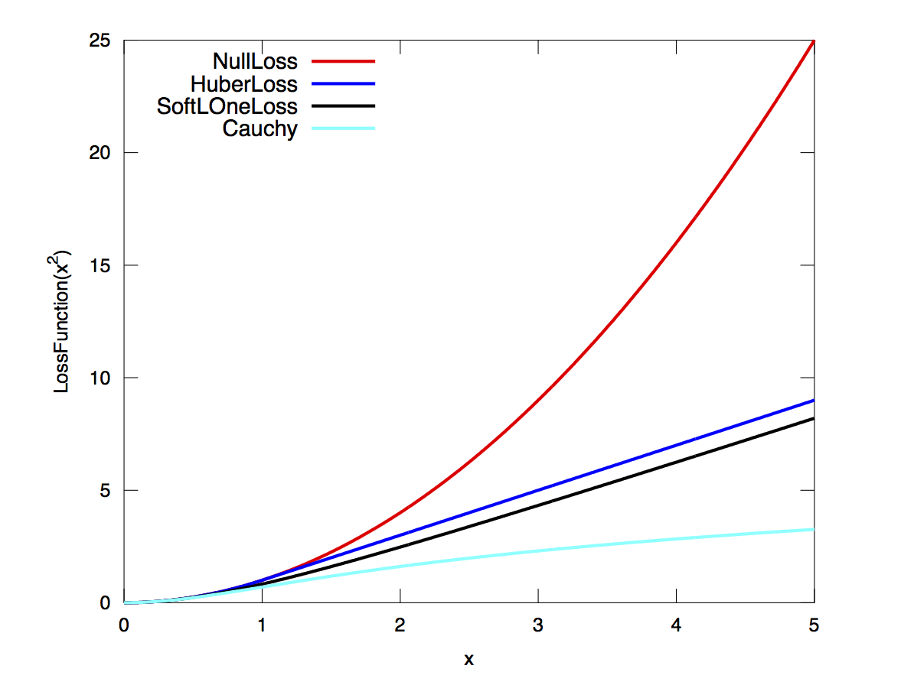

.. default-domain:: cpp

.. cpp:namespace:: ceres

.. _`chapter-nnls_modeling`:

=================================
Modeling Non-linear Least Squares
=================================

Introduction
============

Ceres solver consists of two distinct parts. A modeling API which
provides a rich set of tools to construct an optimization problem one
term at a time and a solver API that controls the minimization
algorithm. This chapter is devoted to the task of modeling
optimization problems using Ceres. :ref:`chapter-nnls_solving` discusses
the various ways in which an optimization problem can be solved using
Ceres.

Ceres solves robustified bounds constrained non-linear least squares
problems of the form:

.. math:: :label: ceresproblem

   \min_{\mathbf{x}} &\quad \frac{1}{2}\sum_{i}
   \rho_i\left(\left\|f_i\left(x_{i_1},
   ... ,x_{i_k}\right)\right\|^2\right)  \\
   \text{s.t.} &\quad l_j \le x_j \le u_j

In Ceres parlance, the expression
:math:`\rho_i\left(\left\|f_i\left(x_{i_1},...,x_{i_k}\right)\right\|^2\right)`
is known as a **residual block**, where :math:`f_i(\cdot)` is a
:class:`CostFunction` that depends on the **parameter blocks**
:math:`\left\{x_{i_1},... , x_{i_k}\right\}`.

In most optimization problems small groups of scalars occur
together. For example the three components of a translation vector and
the four components of the quaternion that define the pose of a
camera. We refer to such a group of scalars as a **parameter block**. Of
course a parameter block can be just a single scalar too.

:math:`\rho_i` is a :class:`LossFunction`. A :class:`LossFunction` is
a scalar valued function that is used to reduce the influence of
outliers on the solution of non-linear least squares problems.

:math:`l_j` and :math:`u_j` are lower and upper bounds on the
parameter block :math:`x_j`.

As a special case, when :math:`\rho_i(x) = x`, i.e., the identity
function, and :math:`l_j = -\infty` and :math:`u_j = \infty` we get
the more familiar unconstrained `non-linear least squares problem
<http://en.wikipedia.org/wiki/Non-linear_least_squares>`_.

.. math:: :label: ceresproblemunconstrained

   \frac{1}{2}\sum_{i} \left\|f_i\left(x_{i_1}, ... ,x_{i_k}\right)\right\|^2.

:class:`CostFunction`
=====================

For each term in the objective function, a :class:`CostFunction` is
responsible for computing a vector of residuals and if asked a vector
of Jacobian matrices, i.e., given :math:`\left[x_{i_1}, ... ,
x_{i_k}\right]`, compute the vector
:math:`f_i\left(x_{i_1},...,x_{i_k}\right)` and the matrices

 .. math:: J_{ij} = \frac{\partial}{\partial
           x_{i_j}}f_i\left(x_{i_1},...,x_{i_k}\right),\quad \forall j
           \in \{1, \ldots, k\}

.. class:: CostFunction

   .. code-block:: c++

    class CostFunction {
     public:
      virtual bool Evaluate(double const* const* parameters,
                            double* residuals,
                            double** jacobians) = 0;
      const vector<int32>& parameter_block_sizes();
      int num_residuals() const;

     protected:
      vector<int32>* mutable_parameter_block_sizes();
      void set_num_residuals(int num_residuals);
    };

The signature of the :class:`CostFunction` (number and sizes of input
parameter blocks and number of outputs) is stored in
:member:`CostFunction::parameter_block_sizes_` and
:member:`CostFunction::num_residuals_` respectively. User code
inheriting from this class is expected to set these two members with
the corresponding accessors. This information will be verified by the
:class:`Problem` when added with :func:`Problem::AddResidualBlock`.

.. function:: bool CostFunction::Evaluate(double const* const* parameters, double* residuals, double** jacobians)

   Compute the residual vector and the Jacobian matrices.

   ``parameters`` is an array of pointers to arrays containing the
   various parameter blocks. ``parameters`` has the same number of
   elements as :member:`CostFunction::parameter_block_sizes_` and the
   parameter blocks are in the same order as
   :member:`CostFunction::parameter_block_sizes_`.

   ``residuals`` is an array of size ``num_residuals_``.

   ``jacobians`` is an array of size
   :member:`CostFunction::parameter_block_sizes_` containing pointers
   to storage for Jacobian matrices corresponding to each parameter
   block. The Jacobian matrices are in the same order as
   :member:`CostFunction::parameter_block_sizes_`. ``jacobians[i]`` is
   an array that contains :member:`CostFunction::num_residuals_` x
   :member:`CostFunction::parameter_block_sizes_` ``[i]``
   elements. Each Jacobian matrix is stored in row-major order, i.e.,
   ``jacobians[i][r * parameter_block_size_[i] + c]`` =
   :math:`\frac{\partial residual[r]}{\partial parameters[i][c]}`

   If ``jacobians`` is ``NULL``, then no derivatives are returned;
   this is the case when computing cost only. If ``jacobians[i]`` is
   ``NULL``, then the Jacobian matrix corresponding to the
   :math:`i^{\textrm{th}}` parameter block must not be returned, this
   is the case when a parameter block is marked constant.

   **NOTE** The return value indicates whether the computation of the
   residuals and/or jacobians was successful or not.

   This can be used to communicate numerical failures in Jacobian
   computations for instance.

:class:`SizedCostFunction`
==========================

.. class:: SizedCostFunction

   If the size of the parameter blocks and the size of the residual
   vector is known at compile time (this is the common case),
   :class:`SizeCostFunction` can be used where these values can be
   specified as template parameters and the user only needs to
   implement :func:`CostFunction::Evaluate`.

   .. code-block:: c++

    template<int kNumResiduals,
             int N0 = 0, int N1 = 0, int N2 = 0, int N3 = 0, int N4 = 0,
             int N5 = 0, int N6 = 0, int N7 = 0, int N8 = 0, int N9 = 0>
    class SizedCostFunction : public CostFunction {
     public:
      virtual bool Evaluate(double const* const* parameters,
                            double* residuals,
                            double** jacobians) const = 0;
    };

:class:`AutoDiffCostFunction`
=============================

.. class:: AutoDiffCostFunction

   Defining a :class:`CostFunction` or a :class:`SizedCostFunction`
   can be a tedious and error prone especially when computing
   derivatives.  To this end Ceres provides `automatic differentiation
   <http://en.wikipedia.org/wiki/Automatic_differentiation>`_.

   .. code-block:: c++

     template <typename CostFunctor,
            int kNumResiduals,  // Number of residuals, or ceres::DYNAMIC.
            int N0,       // Number of parameters in block 0.
            int N1 = 0,   // Number of parameters in block 1.
            int N2 = 0,   // Number of parameters in block 2.
            int N3 = 0,   // Number of parameters in block 3.
            int N4 = 0,   // Number of parameters in block 4.
            int N5 = 0,   // Number of parameters in block 5.
            int N6 = 0,   // Number of parameters in block 6.
            int N7 = 0,   // Number of parameters in block 7.
            int N8 = 0,   // Number of parameters in block 8.
            int N9 = 0>   // Number of parameters in block 9.
     class AutoDiffCostFunction : public
     SizedCostFunction<kNumResiduals, N0, N1, N2, N3, N4, N5, N6, N7, N8, N9> {
      public:
       explicit AutoDiffCostFunction(CostFunctor* functor);
       // Ignore the template parameter kNumResiduals and use
       // num_residuals instead.
       AutoDiffCostFunction(CostFunctor* functor, int num_residuals);
     };

   To get an auto differentiated cost function, you must define a
   class with a templated ``operator()`` (a functor) that computes the
   cost function in terms of the template parameter ``T``. The
   autodiff framework substitutes appropriate ``Jet`` objects for
   ``T`` in order to compute the derivative when necessary, but this
   is hidden, and you should write the function as if ``T`` were a
   scalar type (e.g. a double-precision floating point number).

   The function must write the computed value in the last argument
   (the only non-``const`` one) and return true to indicate success.

   For example, consider a scalar error :math:`e = k - x^\top y`,
   where both :math:`x` and :math:`y` are two-dimensional vector
   parameters and :math:`k` is a constant. The form of this error,
   which is the difference between a constant and an expression, is a
   common pattern in least squares problems. For example, the value
   :math:`x^\top y` might be the model expectation for a series of
   measurements, where there is an instance of the cost function for
   each measurement :math:`k`.

   The actual cost added to the total problem is :math:`e^2`, or
   :math:`(k - x^\top y)^2`; however, the squaring is implicitly done
   by the optimization framework.

   To write an auto-differentiable cost function for the above model,
   first define the object

   .. code-block:: c++

    class MyScalarCostFunctor {
      MyScalarCostFunctor(double k): k_(k) {}

      template <typename T>
      bool operator()(const T* const x , const T* const y, T* e) const {
        e[0] = k_ - x[0] * y[0] - x[1] * y[1];
        return true;
      }

     private:
      double k_;
    };

   Note that in the declaration of ``operator()`` the input parameters
   ``x`` and ``y`` come first, and are passed as const pointers to arrays
   of ``T``. If there were three input parameters, then the third input
   parameter would come after ``y``. The output is always the last
   parameter, and is also a pointer to an array. In the example above,
   ``e`` is a scalar, so only ``e[0]`` is set.

   Then given this class definition, the auto differentiated cost
   function for it can be constructed as follows.

   .. code-block:: c++

    CostFunction* cost_function
        = new AutoDiffCostFunction<MyScalarCostFunctor, 1, 2, 2>(
            new MyScalarCostFunctor(1.0));              ^  ^  ^
                                                        |  |  |
                            Dimension of residual ------+  |  |
                            Dimension of x ----------------+  |
                            Dimension of y -------------------+

   In this example, there is usually an instance for each measurement
   of ``k``.

   In the instantiation above, the template parameters following
   ``MyScalarCostFunction``, ``<1, 2, 2>`` describe the functor as
   computing a 1-dimensional output from two arguments, both
   2-dimensional.

   :class:`AutoDiffCostFunction` also supports cost functions with a
   runtime-determined number of residuals. For example:

   .. code-block:: c++

     CostFunction* cost_function
         = new AutoDiffCostFunction<MyScalarCostFunctor, DYNAMIC, 2, 2>(
             new CostFunctorWithDynamicNumResiduals(1.0),   ^     ^  ^
             runtime_number_of_residuals); <----+           |     |  |
                                                |           |     |  |
                                                |           |     |  |
               Actual number of residuals ------+           |     |  |
               Indicate dynamic number of residuals --------+     |  |
               Dimension of x ------------------------------------+  |
               Dimension of y ---------------------------------------+

   The framework can currently accommodate cost functions of up to 10
   independent variables, and there is no limit on the dimensionality
   of each of them.

   **WARNING 1** A common beginner's error when first using
   :class:`AutoDiffCostFunction` is to get the sizing wrong. In particular,
   there is a tendency to set the template parameters to (dimension of
   residual, number of parameters) instead of passing a dimension
   parameter for *every parameter block*. In the example above, that
   would be ``<MyScalarCostFunction, 1, 2>``, which is missing the 2
   as the last template argument.

:class:`DynamicAutoDiffCostFunction`
====================================

.. class:: DynamicAutoDiffCostFunction

   :class:`AutoDiffCostFunction` requires that the number of parameter
   blocks and their sizes be known at compile time. It also has an
   upper limit of 10 parameter blocks. In a number of applications,
   this is not enough e.g., Bezier curve fitting, Neural Network
   training etc.

     .. code-block:: c++

      template <typename CostFunctor, int Stride = 4>
      class DynamicAutoDiffCostFunction : public CostFunction {
      };

   In such cases :class:`DynamicAutoDiffCostFunction` can be
   used. Like :class:`AutoDiffCostFunction` the user must define a
   templated functor, but the signature of the functor differs
   slightly. The expected interface for the cost functors is:

     .. code-block:: c++

       struct MyCostFunctor {
         template<typename T>
         bool operator()(T const* const* parameters, T* residuals) const {
         }
       }

   Since the sizing of the parameters is done at runtime, you must
   also specify the sizes after creating the dynamic autodiff cost
   function. For example:

     .. code-block:: c++

       DynamicAutoDiffCostFunction<MyCostFunctor, 4>* cost_function =
         new DynamicAutoDiffCostFunction<MyCostFunctor, 4>(
           new MyCostFunctor());
       cost_function->AddParameterBlock(5);
       cost_function->AddParameterBlock(10);
       cost_function->SetNumResiduals(21);

   Under the hood, the implementation evaluates the cost function
   multiple times, computing a small set of the derivatives (four by
   default, controlled by the ``Stride`` template parameter) with each
   pass. There is a performance tradeoff with the size of the passes;
   Smaller sizes are more cache efficient but result in larger number
   of passes, and larger stride lengths can destroy cache-locality
   while reducing the number of passes over the cost function. The
   optimal value depends on the number and sizes of the various
   parameter blocks.

   As a rule of thumb, try using :class:`AutoDiffCostFunction` before
   you use :class:`DynamicAutoDiffCostFunction`.

:class:`NumericDiffCostFunction`
================================

.. class:: NumericDiffCostFunction

  In some cases, its not possible to define a templated cost functor,
  for example when the evaluation of the residual involves a call to a
  library function that you do not have control over.  In such a
  situation, `numerical differentiation
  <http://en.wikipedia.org/wiki/Numerical_differentiation>`_ can be
  used.

  .. NOTE ::

    TODO(sameeragarwal): Add documentation for the constructor and for
    NumericDiffOptions. Update DynamicNumericDiffOptions in a similar
    manner.

  .. code-block:: c++

      template <typename CostFunctor,
                NumericDiffMethodType method = CENTRAL,
                int kNumResiduals,  // Number of residuals, or ceres::DYNAMIC.
                int N0,       // Number of parameters in block 0.
                int N1 = 0,   // Number of parameters in block 1.
                int N2 = 0,   // Number of parameters in block 2.
                int N3 = 0,   // Number of parameters in block 3.
                int N4 = 0,   // Number of parameters in block 4.
                int N5 = 0,   // Number of parameters in block 5.
                int N6 = 0,   // Number of parameters in block 6.
                int N7 = 0,   // Number of parameters in block 7.
                int N8 = 0,   // Number of parameters in block 8.
                int N9 = 0>   // Number of parameters in block 9.
      class NumericDiffCostFunction : public
      SizedCostFunction<kNumResiduals, N0, N1, N2, N3, N4, N5, N6, N7, N8, N9> {
      };

  To get a numerically differentiated :class:`CostFunction`, you must
  define a class with a ``operator()`` (a functor) that computes the
  residuals. The functor must write the computed value in the last
  argument (the only non-``const`` one) and return ``true`` to
  indicate success.  Please see :class:`CostFunction` for details on
  how the return value may be used to impose simple constraints on the
  parameter block. e.g., an object of the form

  .. code-block:: c++

     struct ScalarFunctor {
      public:
       bool operator()(const double* const x1,
                       const double* const x2,
                       double* residuals) const;
     }

  For example, consider a scalar error :math:`e = k - x'y`, where both
  :math:`x` and :math:`y` are two-dimensional column vector
  parameters, the prime sign indicates transposition, and :math:`k` is
  a constant. The form of this error, which is the difference between
  a constant and an expression, is a common pattern in least squares
  problems. For example, the value :math:`x'y` might be the model
  expectation for a series of measurements, where there is an instance
  of the cost function for each measurement :math:`k`.

  To write an numerically-differentiable class:`CostFunction` for the
  above model, first define the object

  .. code-block::  c++

     class MyScalarCostFunctor {
       MyScalarCostFunctor(double k): k_(k) {}

       bool operator()(const double* const x,
                       const double* const y,
                       double* residuals) const {
         residuals[0] = k_ - x[0] * y[0] + x[1] * y[1];
         return true;
       }

      private:
       double k_;
     };

  Note that in the declaration of ``operator()`` the input parameters
  ``x`` and ``y`` come first, and are passed as const pointers to
  arrays of ``double`` s. If there were three input parameters, then
  the third input parameter would come after ``y``. The output is
  always the last parameter, and is also a pointer to an array. In the
  example above, the residual is a scalar, so only ``residuals[0]`` is
  set.

  Then given this class definition, the numerically differentiated
  :class:`CostFunction` with central differences used for computing
  the derivative can be constructed as follows.

  .. code-block:: c++

    CostFunction* cost_function
        = new NumericDiffCostFunction<MyScalarCostFunctor, CENTRAL, 1, 2, 2>(
            new MyScalarCostFunctor(1.0));                    ^     ^  ^  ^
                                                              |     |  |  |
                                  Finite Differencing Scheme -+     |  |  |
                                  Dimension of residual ------------+  |  |
                                  Dimension of x ----------------------+  |
                                  Dimension of y -------------------------+

  In this example, there is usually an instance for each measurement
  of `k`.

  In the instantiation above, the template parameters following
  ``MyScalarCostFunctor``, ``1, 2, 2``, describe the functor as
  computing a 1-dimensional output from two arguments, both
  2-dimensional.

  NumericDiffCostFunction also supports cost functions with a
  runtime-determined number of residuals. For example:

   .. code-block:: c++

     CostFunction* cost_function
         = new NumericDiffCostFunction<MyScalarCostFunctor, CENTRAL, DYNAMIC, 2, 2>(
             new CostFunctorWithDynamicNumResiduals(1.0),               ^     ^  ^
             TAKE_OWNERSHIP,                                            |     |  |
             runtime_number_of_residuals); <----+                       |     |  |
                                                |                       |     |  |
                                                |                       |     |  |
               Actual number of residuals ------+                       |     |  |
               Indicate dynamic number of residuals --------------------+     |  |
               Dimension of x ------------------------------------------------+  |
               Dimension of y ---------------------------------------------------+

  The framework can currently accommodate cost functions of up to 10
  independent variables, and there is no limit on the dimensionality
  of each of them.

  There are three available numeric differentiation schemes in ceres-solver:

  The ``FORWARD`` difference method, which approximates :math:`f'(x)`
  by computing :math:`\frac{f(x+h)-f(x)}{h}`, computes the cost
  function one additional time at :math:`x+h`. It is the fastest but
  least accurate method.

  The ``CENTRAL`` difference method is more accurate at the cost of
  twice as many function evaluations than forward difference,
  estimating :math:`f'(x)` by computing
  :math:`\frac{f(x+h)-f(x-h)}{2h}`.

  The ``RIDDERS`` difference method[Ridders]_ is an adaptive scheme
  that estimates derivatives by performing multiple central
  differences at varying scales. Specifically, the algorithm starts at
  a certain :math:`h` and as the derivative is estimated, this step
  size decreases.  To conserve function evaluations and estimate the
  derivative error, the method performs Richardson extrapolations
  between the tested step sizes.  The algorithm exhibits considerably
  higher accuracy, but does so by additional evaluations of the cost
  function.

  Consider using ``CENTRAL`` differences to begin with. Based on the
  results, either try forward difference to improve performance or
  Ridders' method to improve accuracy.

  **WARNING** A common beginner's error when first using
  :class:`NumericDiffCostFunction` is to get the sizing wrong. In
  particular, there is a tendency to set the template parameters to
  (dimension of residual, number of parameters) instead of passing a
  dimension parameter for *every parameter*. In the example above,
  that would be ``<MyScalarCostFunctor, 1, 2>``, which is missing the
  last ``2`` argument. Please be careful when setting the size
  parameters.

Numeric Differentiation & LocalParameterization
-----------------------------------------------

   If your cost function depends on a parameter block that must lie on
   a manifold and the functor cannot be evaluated for values of that
   parameter block not on the manifold then you may have problems
   numerically differentiating such functors.

   This is because numeric differentiation in Ceres is performed by
   perturbing the individual coordinates of the parameter blocks that
   a cost functor depends on. In doing so, we assume that the
   parameter blocks live in an Euclidean space and ignore the
   structure of manifold that they live As a result some of the
   perturbations may not lie on the manifold corresponding to the
   parameter block.

   For example consider a four dimensional parameter block that is
   interpreted as a unit Quaternion. Perturbing the coordinates of
   this parameter block will violate the unit norm property of the
   parameter block.

   Fixing this problem requires that :class:`NumericDiffCostFunction`
   be aware of the :class:`LocalParameterization` associated with each
   parameter block and only generate perturbations in the local
   tangent space of each parameter block.

   For now this is not considered to be a serious enough problem to
   warrant changing the :class:`NumericDiffCostFunction` API. Further,
   in most cases it is relatively straightforward to project a point
   off the manifold back onto the manifold before using it in the
   functor. For example in case of the Quaternion, normalizing the
   4-vector before using it does the trick.

   **Alternate Interface**

   For a variety of reasons, including compatibility with legacy code,
   :class:`NumericDiffCostFunction` can also take
   :class:`CostFunction` objects as input. The following describes
   how.

   To get a numerically differentiated cost function, define a
   subclass of :class:`CostFunction` such that the
   :func:`CostFunction::Evaluate` function ignores the ``jacobians``
   parameter. The numeric differentiation wrapper will fill in the
   jacobian parameter if necessary by repeatedly calling the
   :func:`CostFunction::Evaluate` with small changes to the
   appropriate parameters, and computing the slope. For performance,
   the numeric differentiation wrapper class is templated on the
   concrete cost function, even though it could be implemented only in
   terms of the :class:`CostFunction` interface.

   The numerically differentiated version of a cost function for a
   cost function can be constructed as follows:

   .. code-block:: c++

     CostFunction* cost_function
         = new NumericDiffCostFunction<MyCostFunction, CENTRAL, 1, 4, 8>(
             new MyCostFunction(...), TAKE_OWNERSHIP);

   where ``MyCostFunction`` has 1 residual and 2 parameter blocks with
   sizes 4 and 8 respectively. Look at the tests for a more detailed
   example.

:class:`DynamicNumericDiffCostFunction`
=======================================

.. class:: DynamicNumericDiffCostFunction

   Like :class:`AutoDiffCostFunction` :class:`NumericDiffCostFunction`
   requires that the number of parameter blocks and their sizes be
   known at compile time. It also has an upper limit of 10 parameter
   blocks. In a number of applications, this is not enough.

     .. code-block:: c++

      template <typename CostFunctor, NumericDiffMethodType method = CENTRAL>
      class DynamicNumericDiffCostFunction : public CostFunction {
      };

   In such cases when numeric differentiation is desired,
   :class:`DynamicNumericDiffCostFunction` can be used.

   Like :class:`NumericDiffCostFunction` the user must define a
   functor, but the signature of the functor differs slightly. The
   expected interface for the cost functors is:

     .. code-block:: c++

       struct MyCostFunctor {
         bool operator()(double const* const* parameters, double* residuals) const {
         }
       }

   Since the sizing of the parameters is done at runtime, you must
   also specify the sizes after creating the dynamic numeric diff cost
   function. For example:

     .. code-block:: c++

       DynamicNumericDiffCostFunction<MyCostFunctor>* cost_function =
         new DynamicNumericDiffCostFunction<MyCostFunctor>(new MyCostFunctor);
       cost_function->AddParameterBlock(5);
       cost_function->AddParameterBlock(10);
       cost_function->SetNumResiduals(21);

   As a rule of thumb, try using :class:`NumericDiffCostFunction` before
   you use :class:`DynamicNumericDiffCostFunction`.

   **WARNING** The same caution about mixing local parameterizations
   with numeric differentiation applies as is the case with
   :class:`NumericDiffCostFunction`.

:class:`CostFunctionToFunctor`
==============================

.. class:: CostFunctionToFunctor

   :class:`CostFunctionToFunctor` is an adapter class that allows
   users to use :class:`CostFunction` objects in templated functors
   which are to be used for automatic differentiation. This allows
   the user to seamlessly mix analytic, numeric and automatic
   differentiation.

   For example, let us assume that

   .. code-block:: c++

     class IntrinsicProjection : public SizedCostFunction<2, 5, 3> {
       public:
         IntrinsicProjection(const double* observation);
         virtual bool Evaluate(double const* const* parameters,
                               double* residuals,
                               double** jacobians) const;
     };

   is a :class:`CostFunction` that implements the projection of a
   point in its local coordinate system onto its image plane and
   subtracts it from the observed point projection. It can compute its
   residual and either via analytic or numerical differentiation can
   compute its jacobians.

   Now we would like to compose the action of this
   :class:`CostFunction` with the action of camera extrinsics, i.e.,
   rotation and translation. Say we have a templated function

   .. code-block:: c++

      template<typename T>
      void RotateAndTranslatePoint(const T* rotation,
                                   const T* translation,
                                   const T* point,
                                   T* result);

   Then we can now do the following,

   .. code-block:: c++

    struct CameraProjection {
      CameraProjection(double* observation)
      : intrinsic_projection_(new IntrinsicProjection(observation)) {
      }

      template <typename T>
      bool operator()(const T* rotation,
                      const T* translation,
                      const T* intrinsics,
                      const T* point,
                      T* residual) const {
        T transformed_point[3];
        RotateAndTranslatePoint(rotation, translation, point, transformed_point);

        // Note that we call intrinsic_projection_, just like it was
        // any other templated functor.
        return intrinsic_projection_(intrinsics, transformed_point, residual);
      }

     private:
      CostFunctionToFunctor<2,5,3> intrinsic_projection_;
    };

   Note that :class:`CostFunctionToFunctor` takes ownership of the
   :class:`CostFunction` that was passed in to the constructor.

   In the above example, we assumed that ``IntrinsicProjection`` is a
   ``CostFunction`` capable of evaluating its value and its
   derivatives. Suppose, if that were not the case and
   ``IntrinsicProjection`` was defined as follows:

   .. code-block:: c++

    struct IntrinsicProjection
      IntrinsicProjection(const double* observation) {
        observation_[0] = observation[0];
        observation_[1] = observation[1];
      }

      bool operator()(const double* calibration,
                      const double* point,
                      double* residuals) {
        double projection[2];
        ThirdPartyProjectionFunction(calibration, point, projection);
        residuals[0] = observation_[0] - projection[0];
        residuals[1] = observation_[1] - projection[1];
        return true;
      }
     double observation_[2];
    };

  Here ``ThirdPartyProjectionFunction`` is some third party library
  function that we have no control over. So this function can compute
  its value and we would like to use numeric differentiation to
  compute its derivatives. In this case we can use a combination of
  ``NumericDiffCostFunction`` and ``CostFunctionToFunctor`` to get the
  job done.

  .. code-block:: c++

   struct CameraProjection {
     CameraProjection(double* observation)
       intrinsic_projection_(
         new NumericDiffCostFunction<IntrinsicProjection, CENTRAL, 2, 5, 3>(
           new IntrinsicProjection(observation)) {
     }

     template <typename T>
     bool operator()(const T* rotation,
                     const T* translation,
                     const T* intrinsics,
                     const T* point,
                     T* residuals) const {
       T transformed_point[3];
       RotateAndTranslatePoint(rotation, translation, point, transformed_point);
       return intrinsic_projection_(intrinsics, transformed_point, residual);
     }

    private:
     CostFunctionToFunctor<2,5,3> intrinsic_projection_;
   };

:class:`DynamicCostFunctionToFunctor`
=====================================

.. class:: DynamicCostFunctionToFunctor

   :class:`DynamicCostFunctionToFunctor` provides the same functionality as
   :class:`CostFunctionToFunctor` for cases where the number and size of the
   parameter vectors and residuals are not known at compile-time. The API
   provided by :class:`DynamicCostFunctionToFunctor` matches what would be
   expected by :class:`DynamicAutoDiffCostFunction`, i.e. it provides a
   templated functor of this form:

   .. code-block:: c++

    template<typename T>
    bool operator()(T const* const* parameters, T* residuals) const;

   Similar to the example given for :class:`CostFunctionToFunctor`, let us
   assume that

   .. code-block:: c++

     class IntrinsicProjection : public CostFunction {
       public:
         IntrinsicProjection(const double* observation);
         virtual bool Evaluate(double const* const* parameters,
                               double* residuals,
                               double** jacobians) const;
     };

   is a :class:`CostFunction` that projects a point in its local coordinate
   system onto its image plane and subtracts it from the observed point
   projection.

   Using this :class:`CostFunction` in a templated functor would then look like
   this:

   .. code-block:: c++

    struct CameraProjection {
      CameraProjection(double* observation)
          : intrinsic_projection_(new IntrinsicProjection(observation)) {
      }

      template <typename T>
      bool operator()(T const* const* parameters,
                      T* residual) const {
        const T* rotation = parameters[0];
        const T* translation = parameters[1];
        const T* intrinsics = parameters[2];
        const T* point = parameters[3];

        T transformed_point[3];
        RotateAndTranslatePoint(rotation, translation, point, transformed_point);

        const T* projection_parameters[2];
        projection_parameters[0] = intrinsics;
        projection_parameters[1] = transformed_point;
        return intrinsic_projection_(projection_parameters, residual);
      }

     private:
      DynamicCostFunctionToFunctor intrinsic_projection_;
    };

   Like :class:`CostFunctionToFunctor`, :class:`DynamicCostFunctionToFunctor`
   takes ownership of the :class:`CostFunction` that was passed in to the
   constructor.

:class:`ConditionedCostFunction`
================================

.. class:: ConditionedCostFunction

   This class allows you to apply different conditioning to the residual
   values of a wrapped cost function. An example where this is useful is
   where you have an existing cost function that produces N values, but you
   want the total cost to be something other than just the sum of these
   squared values - maybe you want to apply a different scaling to some
   values, to change their contribution to the cost.

   Usage:

   .. code-block:: c++

       //  my_cost_function produces N residuals
       CostFunction* my_cost_function = ...
       CHECK_EQ(N, my_cost_function->num_residuals());
       vector<CostFunction*> conditioners;

       //  Make N 1x1 cost functions (1 parameter, 1 residual)
       CostFunction* f_1 = ...
       conditioners.push_back(f_1);

       CostFunction* f_N = ...
       conditioners.push_back(f_N);
       ConditionedCostFunction* ccf =
         new ConditionedCostFunction(my_cost_function, conditioners);

   Now ``ccf`` 's ``residual[i]`` (i=0..N-1) will be passed though the
   :math:`i^{\text{th}}` conditioner.

   .. code-block:: c++

      ccf_residual[i] = f_i(my_cost_function_residual[i])

   and the Jacobian will be affected appropriately.

:class:`GradientChecker`
================================

.. class:: GradientChecker

    This class compares the Jacobians returned by a cost function against
    derivatives estimated using finite differencing. It is meant as a tool for
    unit testing, giving you more fine-grained control than the check_gradients
    option in the solver options.

    The condition enforced is that

    .. math:: \forall{i,j}: \frac{J_{ij} - J'_{ij}}{max_{ij}(J_{ij} - J'_{ij})} < r

    where :math:`J_{ij}` is the jacobian as computed by the supplied cost
    function (by the user) multiplied by the local parameterization Jacobian,
    :math:`J'_{ij}` is the jacobian as computed by finite differences,
    multiplied by the local parameterization Jacobian as well, and :math:`r`
    is the relative precision.

   Usage:

   .. code-block:: c++

       //  my_cost_function takes two parameter blocks. The first has a local
       //  parameterization associated with it.
       CostFunction* my_cost_function = ...
       LocalParameterization* my_parameterization = ...
       NumericDiffOptions numeric_diff_options;

       std::vector<LocalParameterization*> local_parameterizations;
       local_parameterizations.push_back(my_parameterization);
       local_parameterizations.push_back(NULL);

       std::vector parameter1;
       std::vector parameter2;
       // Fill parameter 1 & 2 with test data...

       std::vector<double*> parameter_blocks;
       parameter_blocks.push_back(parameter1.data());
       parameter_blocks.push_back(parameter2.data());

       GradientChecker gradient_checker(my_cost_function,
           local_parameterizations, numeric_diff_options);
       GradientCheckResults results;
       if (!gradient_checker.Probe(parameter_blocks.data(), 1e-9, &results) {
         LOG(ERROR) << "An error has occurred:\n" << results.error_log;
       }

:class:`NormalPrior`
====================

.. class:: NormalPrior

   .. code-block:: c++

     class NormalPrior: public CostFunction {
      public:
       // Check that the number of rows in the vector b are the same as the
       // number of columns in the matrix A, crash otherwise.
       NormalPrior(const Matrix& A, const Vector& b);

       virtual bool Evaluate(double const* const* parameters,
                             double* residuals,
                             double** jacobians) const;
      };

   Implements a cost function of the form

   .. math::  cost(x) = ||A(x - b)||^2

   where, the matrix :math:`A` and the vector :math:`b` are fixed and :math:`x`
   is the variable. In case the user is interested in implementing a cost
   function of the form

  .. math::  cost(x) = (x - \mu)^T S^{-1} (x - \mu)

  where, :math:`\mu` is a vector and :math:`S` is a covariance matrix,
  then, :math:`A = S^{-1/2}`, i.e the matrix :math:`A` is the square
  root of the inverse of the covariance, also known as the stiffness
  matrix. There are however no restrictions on the shape of
  :math:`A`. It is free to be rectangular, which would be the case if
  the covariance matrix :math:`S` is rank deficient.

.. _`section-loss_function`:

:class:`LossFunction`
=====================

.. class:: LossFunction

   For least squares problems where the minimization may encounter
   input terms that contain outliers, that is, completely bogus
   measurements, it is important to use a loss function that reduces
   their influence.

   Consider a structure from motion problem. The unknowns are 3D
   points and camera parameters, and the measurements are image
   coordinates describing the expected reprojected position for a
   point in a camera. For example, we want to model the geometry of a
   street scene with fire hydrants and cars, observed by a moving
   camera with unknown parameters, and the only 3D points we care
   about are the pointy tippy-tops of the fire hydrants. Our magic
   image processing algorithm, which is responsible for producing the
   measurements that are input to Ceres, has found and matched all
   such tippy-tops in all image frames, except that in one of the
   frame it mistook a car's headlight for a hydrant. If we didn't do
   anything special the residual for the erroneous measurement will
   result in the entire solution getting pulled away from the optimum
   to reduce the large error that would otherwise be attributed to the
   wrong measurement.

   Using a robust loss function, the cost for large residuals is
   reduced. In the example above, this leads to outlier terms getting
   down-weighted so they do not overly influence the final solution.

   .. code-block:: c++

    class LossFunction {
     public:
      virtual void Evaluate(double s, double out[3]) const = 0;
    };

   The key method is :func:`LossFunction::Evaluate`, which given a
   non-negative scalar ``s``, computes

   .. math:: out = \begin{bmatrix}\rho(s), & \rho'(s), & \rho''(s)\end{bmatrix}

   Here the convention is that the contribution of a term to the cost
   function is given by :math:`\frac{1}{2}\rho(s)`, where :math:`s
   =\|f_i\|^2`. Calling the method with a negative value of :math:`s`
   is an error and the implementations are not required to handle that
   case.

   Most sane choices of :math:`\rho` satisfy:

   .. math::

      \rho(0) &= 0\\
      \rho'(0) &= 1\\
      \rho'(s) &< 1 \text{ in the outlier region}\\
      \rho''(s) &< 0 \text{ in the outlier region}

   so that they mimic the squared cost for small residuals.

   **Scaling**

   Given one robustifier :math:`\rho(s)` one can change the length
   scale at which robustification takes place, by adding a scale
   factor :math:`a > 0` which gives us :math:`\rho(s,a) = a^2 \rho(s /
   a^2)` and the first and second derivatives as :math:`\rho'(s /
   a^2)` and :math:`(1 / a^2) \rho''(s / a^2)` respectively.

   The reason for the appearance of squaring is that :math:`a` is in
   the units of the residual vector norm whereas :math:`s` is a squared
   norm. For applications it is more convenient to specify :math:`a` than
   its square.

Instances
---------

Ceres includes a number of predefined loss functions. For simplicity
we described their unscaled versions. The figure below illustrates
their shape graphically. More details can be found in
``include/ceres/loss_function.h``.

   Shape of the various common loss functions.

.. class:: TrivialLoss

      .. math:: \rho(s) = s

.. class:: HuberLoss

   .. math:: \rho(s) = \begin{cases} s & s \le 1\\ 2 \sqrt{s} - 1 & s > 1 \end{cases}

.. class:: SoftLOneLoss

   .. math:: \rho(s) = 2 (\sqrt{1+s} - 1)

.. class:: CauchyLoss

   .. math:: \rho(s) = \log(1 + s)

.. class:: ArctanLoss

   .. math:: \rho(s) = \arctan(s)

.. class:: TolerantLoss

   .. math:: \rho(s,a,b) = b \log(1 + e^{(s - a) / b}) - b \log(1 + e^{-a / b})

.. class:: ComposedLoss

   Given two loss functions ``f`` and ``g``, implements the loss
   function ``h(s) = f(g(s))``.

   .. code-block:: c++

      class ComposedLoss : public LossFunction {
       public:
        explicit ComposedLoss(const LossFunction* f,
                              Ownership ownership_f,
                              const LossFunction* g,
                              Ownership ownership_g);
      };

.. class:: ScaledLoss

   Sometimes you want to simply scale the output value of the
   robustifier. For example, you might want to weight different error
   terms differently (e.g., weight pixel reprojection errors
   differently from terrain errors).

   Given a loss function :math:`\rho(s)` and a scalar :math:`a`, :class:`ScaledLoss`
   implements the function :math:`a \rho(s)`.

   Since we treat a ``NULL`` Loss function as the Identity loss
   function, :math:`rho` = ``NULL``: is a valid input and will result
   in the input being scaled by :math:`a`. This provides a simple way
   of implementing a scaled ResidualBlock.

.. class:: LossFunctionWrapper

   Sometimes after the optimization problem has been constructed, we
   wish to mutate the scale of the loss function. For example, when
   performing estimation from data which has substantial outliers,
   convergence can be improved by starting out with a large scale,
   optimizing the problem and then reducing the scale. This can have
   better convergence behavior than just using a loss function with a
   small scale.

   This templated class allows the user to implement a loss function
   whose scale can be mutated after an optimization problem has been
   constructed, e.g,

   .. code-block:: c++

     Problem problem;

     // Add parameter blocks

     CostFunction* cost_function =
         new AutoDiffCostFunction < UW_Camera_Mapper, 2, 9, 3>(
             new UW_Camera_Mapper(feature_x, feature_y));

     LossFunctionWrapper* loss_function(new HuberLoss(1.0), TAKE_OWNERSHIP);
     problem.AddResidualBlock(cost_function, loss_function, parameters);

     Solver::Options options;
     Solver::Summary summary;
     Solve(options, &problem, &summary);

     loss_function->Reset(new HuberLoss(1.0), TAKE_OWNERSHIP);
     Solve(options, &problem, &summary);

Theory
------

Let us consider a problem with a single problem and a single parameter
block.

.. math::

 \min_x \frac{1}{2}\rho(f^2(x))

Then, the robustified gradient and the Gauss-Newton Hessian are

.. math::

        g(x) &= \rho'J^\top(x)f(x)\\
        H(x) &= J^\top(x)\left(\rho' + 2 \rho''f(x)f^\top(x)\right)J(x)

where the terms involving the second derivatives of :math:`f(x)` have
been ignored. Note that :math:`H(x)` is indefinite if
:math:`\rho''f(x)^\top f(x) + \frac{1}{2}\rho' < 0`. If this is not
the case, then its possible to re-weight the residual and the Jacobian
matrix such that the corresponding linear least squares problem for
the robustified Gauss-Newton step.

Let :math:`\alpha` be a root of

.. math:: \frac{1}{2}\alpha^2 - \alpha - \frac{\rho''}{\rho'}\|f(x)\|^2 = 0.

Then, define the rescaled residual and Jacobian as

.. math::

        \tilde{f}(x) &= \frac{\sqrt{\rho'}}{1 - \alpha} f(x)\\
        \tilde{J}(x) &= \sqrt{\rho'}\left(1 - \alpha
                        \frac{f(x)f^\top(x)}{\left\|f(x)\right\|^2} \right)J(x)

In the case :math:`2 \rho''\left\|f(x)\right\|^2 + \rho' \lesssim 0`,
we limit :math:`\alpha \le 1- \epsilon` for some small
:math:`\epsilon`. For more details see [Triggs]_.

With this simple rescaling, one can use any Jacobian based non-linear
least squares algorithm to robustified non-linear least squares
problems.

:class:`LocalParameterization`
==============================

.. class:: LocalParameterization

   .. code-block:: c++

     class LocalParameterization {
      public:
       virtual ~LocalParameterization() {}
       virtual bool Plus(const double* x,
                         const double* delta,
                         double* x_plus_delta) const = 0;
       virtual bool ComputeJacobian(const double* x, double* jacobian) const = 0;
       virtual bool MultiplyByJacobian(const double* x,
                                       const int num_rows,
                                       const double* global_matrix,
                                       double* local_matrix) const;
       virtual int GlobalSize() const = 0;
       virtual int LocalSize() const = 0;
     };

   Sometimes the parameters :math:`x` can overparameterize a
   problem. In that case it is desirable to choose a parameterization
   to remove the null directions of the cost. More generally, if
   :math:`x` lies on a manifold of a smaller dimension than the
   ambient space that it is embedded in, then it is numerically and
   computationally more effective to optimize it using a
   parameterization that lives in the tangent space of that manifold
   at each point.

   For example, a sphere in three dimensions is a two dimensional
   manifold, embedded in a three dimensional space. At each point on
   the sphere, the plane tangent to it defines a two dimensional
   tangent space. For a cost function defined on this sphere, given a
   point :math:`x`, moving in the direction normal to the sphere at
   that point is not useful. Thus a better way to parameterize a point
   on a sphere is to optimize over two dimensional vector
   :math:`\Delta x` in the tangent space at the point on the sphere
   point and then "move" to the point :math:`x + \Delta x`, where the
   move operation involves projecting back onto the sphere. Doing so
   removes a redundant dimension from the optimization, making it
   numerically more robust and efficient.

   More generally we can define a function

   .. math:: x' = \boxplus(x, \Delta x),

   where :math:`x'` has the same size as :math:`x`, and :math:`\Delta
   x` is of size less than or equal to :math:`x`. The function
   :math:`\boxplus`, generalizes the definition of vector
   addition. Thus it satisfies the identity

   .. math:: \boxplus(x, 0) = x,\quad \forall x.

   Instances of :class:`LocalParameterization` implement the
   :math:`\boxplus` operation and its derivative with respect to
   :math:`\Delta x` at :math:`\Delta x = 0`.

.. function:: int LocalParameterization::GlobalSize()

   The dimension of the ambient space in which the parameter block
   :math:`x` lives.

.. function:: int LocalParameterization::LocalSize()

   The size of the tangent space
   that :math:`\Delta x` lives in.

.. function:: bool LocalParameterization::Plus(const double* x, const double* delta, double* x_plus_delta) const

    :func:`LocalParameterization::Plus` implements :math:`\boxplus(x,\Delta x)`.

.. function:: bool LocalParameterization::ComputeJacobian(const double* x, double* jacobian) const

   Computes the Jacobian matrix

   .. math:: J = \left . \frac{\partial }{\partial \Delta x} \boxplus(x,\Delta x)\right|_{\Delta x = 0}

   in row major form.

.. function:: bool MultiplyByJacobian(const double* x, const int num_rows, const double* global_matrix, double* local_matrix) const

   local_matrix = global_matrix * jacobian

   global_matrix is a num_rows x GlobalSize  row major matrix.
   local_matrix is a num_rows x LocalSize row major matrix.
   jacobian is the matrix returned by :func:`LocalParameterization::ComputeJacobian` at :math:`x`.

   This is only used by GradientProblem. For most normal uses, it is
   okay to use the default implementation.

Instances
---------

.. class:: IdentityParameterization

   A trivial version of :math:`\boxplus` is when :math:`\Delta x` is
   of the same size as :math:`x` and

   .. math::  \boxplus(x, \Delta x) = x + \Delta x

.. class:: SubsetParameterization

   A more interesting case if :math:`x` is a two dimensional vector,
   and the user wishes to hold the first coordinate constant. Then,
   :math:`\Delta x` is a scalar and :math:`\boxplus` is defined as

   .. math::

      \boxplus(x, \Delta x) = x + \left[ \begin{array}{c} 0 \\ 1
                                  \end{array} \right] \Delta x

   :class:`SubsetParameterization` generalizes this construction to
   hold any part of a parameter block constant.

.. class:: QuaternionParameterization

   Another example that occurs commonly in Structure from Motion
   problems is when camera rotations are parameterized using a
   quaternion. There, it is useful only to make updates orthogonal to
   that 4-vector defining the quaternion. One way to do this is to let
   :math:`\Delta x` be a 3 dimensional vector and define
   :math:`\boxplus` to be

    .. math:: \boxplus(x, \Delta x) = \left[ \cos(|\Delta x|), \frac{\sin\left(|\Delta x|\right)}{|\Delta x|} \Delta x \right] * x
      :label: quaternion

   The multiplication between the two 4-vectors on the right hand side
   is the standard quaternion
   product. :class:`QuaternionParameterization` is an implementation
   of :eq:`quaternion`.

.. class:: EigenQuaternionParameterization

   Eigen uses a different internal memory layout for the elements of the
   quaternion than what is commonly used. Specifically, Eigen stores the
   elements in memory as [x, y, z, w] where the real part is last
   whereas it is typically stored first. Note, when creating an Eigen
   quaternion through the constructor the elements are accepted in w, x,
   y, z order. Since Ceres operates on parameter blocks which are raw
   double pointers this difference is important and requires a different
   parameterization. :class:`EigenQuaternionParameterization` uses the
   same update as :class:`QuaternionParameterization` but takes into
   account Eigen's internal memory element ordering.

.. class:: HomogeneousVectorParameterization

   In computer vision, homogeneous vectors are commonly used to
   represent entities in projective geometry such as points in
   projective space. One example where it is useful to use this
   over-parameterization is in representing points whose triangulation
   is ill-conditioned. Here it is advantageous to use homogeneous
   vectors, instead of an Euclidean vector, because it can represent
   points at infinity.

   When using homogeneous vectors it is useful to only make updates
   orthogonal to that :math:`n`-vector defining the homogeneous
   vector [HartleyZisserman]_. One way to do this is to let :math:`\Delta x`
   be a :math:`n-1` dimensional vector and define :math:`\boxplus` to be

    .. math:: \boxplus(x, \Delta x) = \left[ \frac{\sin\left(0.5 |\Delta x|\right)}{|\Delta x|} \Delta x, \cos(0.5 |\Delta x|) \right] * x

   The multiplication between the two vectors on the right hand side
   is defined as an operator which applies the update orthogonal to
   :math:`x` to remain on the sphere. Note, it is assumed that
   last element of :math:`x` is the scalar component of the homogeneous
   vector.

.. class:: ProductParameterization

   Consider an optimization problem over the space of rigid
   transformations :math:`SE(3)`, which is the Cartesian product of
   :math:`SO(3)` and :math:`\mathbb{R}^3`. Suppose you are using
   Quaternions to represent the rotation, Ceres ships with a local
   parameterization for that and :math:`\mathbb{R}^3` requires no, or
   :class:`IdentityParameterization` parameterization. So how do we
   construct a local parameterization for a parameter block a rigid
   transformation?

   In cases, where a parameter block is the Cartesian product of a
   number of manifolds and you have the local parameterization of the
   individual manifolds available, :class:`ProductParameterization`
   can be used to construct a local parameterization of the cartesian
   product. For the case of the rigid transformation, where say you
   have a parameter block of size 7, where the first four entries
   represent the rotation as a quaternion, a local parameterization
   can be constructed as

   .. code-block:: c++

     ProductParameterization se3_param(new QuaternionParameterization(),
                                       new IdentityTransformation(3));

:class:`AutoDiffLocalParameterization`
======================================

.. class:: AutoDiffLocalParameterization

  :class:`AutoDiffLocalParameterization` does for
  :class:`LocalParameterization` what :class:`AutoDiffCostFunction`
  does for :class:`CostFunction`. It allows the user to define a
  templated functor that implements the
  :func:`LocalParameterization::Plus` operation and it uses automatic
  differentiation to implement the computation of the Jacobian.

  To get an auto differentiated local parameterization, you must
  define a class with a templated operator() (a functor) that computes

     .. math:: x' = \boxplus(x, \Delta x),

  For example, Quaternions have a three dimensional local
  parameterization. Its plus operation can be implemented as (taken
  from `internal/ceres/autodiff_local_parameterization_test.cc
  <https://ceres-solver.googlesource.com/ceres-solver/+/master/internal/ceres/autodiff_local_parameterization_test.cc>`_
  )

    .. code-block:: c++

      struct QuaternionPlus {
        template<typename T>
        bool operator()(const T* x, const T* delta, T* x_plus_delta) const {
          const T squared_norm_delta =
              delta[0] * delta[0] + delta[1] * delta[1] + delta[2] * delta[2];

          T q_delta[4];
          if (squared_norm_delta > 0.0) {
            T norm_delta = sqrt(squared_norm_delta);
            const T sin_delta_by_delta = sin(norm_delta) / norm_delta;
            q_delta[0] = cos(norm_delta);
            q_delta[1] = sin_delta_by_delta * delta[0];
            q_delta[2] = sin_delta_by_delta * delta[1];
            q_delta[3] = sin_delta_by_delta * delta[2];
          } else {
            // We do not just use q_delta = [1,0,0,0] here because that is a
            // constant and when used for automatic differentiation will
            // lead to a zero derivative. Instead we take a first order
            // approximation and evaluate it at zero.
            q_delta[0] = T(1.0);
            q_delta[1] = delta[0];
            q_delta[2] = delta[1];
            q_delta[3] = delta[2];
          }

          Quaternionproduct(q_delta, x, x_plus_delta);
          return true;
        }
      };

  Given this struct, the auto differentiated local
  parameterization can now be constructed as

  .. code-block:: c++

     LocalParameterization* local_parameterization =
         new AutoDiffLocalParameterization<QuaternionPlus, 4, 3>;
                                                           |  |
                                Global Size ---------------+  |
                                Local Size -------------------+

:class:`Problem`
================

.. class:: Problem

   :class:`Problem` holds the robustified bounds constrained
   non-linear least squares problem :eq:`ceresproblem`. To create a
   least squares problem, use the :func:`Problem::AddResidualBlock`
   and :func:`Problem::AddParameterBlock` methods.

   For example a problem containing 3 parameter blocks of sizes 3, 4
   and 5 respectively and two residual blocks of size 2 and 6:

   .. code-block:: c++

     double x1[] = { 1.0, 2.0, 3.0 };
     double x2[] = { 1.0, 2.0, 3.0, 5.0 };
     double x3[] = { 1.0, 2.0, 3.0, 6.0, 7.0 };

     Problem problem;
     problem.AddResidualBlock(new MyUnaryCostFunction(...), x1);
     problem.AddResidualBlock(new MyBinaryCostFunction(...), x2, x3);

   :func:`Problem::AddResidualBlock` as the name implies, adds a
   residual block to the problem. It adds a :class:`CostFunction`, an
   optional :class:`LossFunction` and connects the
   :class:`CostFunction` to a set of parameter block.

   The cost function carries with it information about the sizes of
   the parameter blocks it expects. The function checks that these
   match the sizes of the parameter blocks listed in
   ``parameter_blocks``. The program aborts if a mismatch is
   detected. ``loss_function`` can be ``NULL``, in which case the cost
   of the term is just the squared norm of the residuals.

   The user has the option of explicitly adding the parameter blocks
   using :func:`Problem::AddParameterBlock`. This causes additional
   correctness checking; however, :func:`Problem::AddResidualBlock`
   implicitly adds the parameter blocks if they are not present, so
   calling :func:`Problem::AddParameterBlock` explicitly is not
   required.

   :func:`Problem::AddParameterBlock` explicitly adds a parameter
   block to the :class:`Problem`. Optionally it allows the user to
   associate a :class:`LocalParameterization` object with the
   parameter block too. Repeated calls with the same arguments are
   ignored. Repeated calls with the same double pointer but a
   different size results in undefined behavior.

   You can set any parameter block to be constant using
   :func:`Problem::SetParameterBlockConstant` and undo this using
   :func:`SetParameterBlockVariable`.

   In fact you can set any number of parameter blocks to be constant,
   and Ceres is smart enough to figure out what part of the problem
   you have constructed depends on the parameter blocks that are free
   to change and only spends time solving it. So for example if you
   constructed a problem with a million parameter blocks and 2 million
   residual blocks, but then set all but one parameter blocks to be
   constant and say only 10 residual blocks depend on this one
   non-constant parameter block. Then the computational effort Ceres
   spends in solving this problem will be the same if you had defined
   a problem with one parameter block and 10 residual blocks.

   **Ownership**

   :class:`Problem` by default takes ownership of the
   ``cost_function``, ``loss_function`` and ``local_parameterization``
   pointers. These objects remain live for the life of the
   :class:`Problem`. If the user wishes to keep control over the
   destruction of these objects, then they can do this by setting the
   corresponding enums in the :class:`Problem::Options` struct.

   Note that even though the Problem takes ownership of ``cost_function``
   and ``loss_function``, it does not preclude the user from re-using
   them in another residual block. The destructor takes care to call
   delete on each ``cost_function`` or ``loss_function`` pointer only
   once, regardless of how many residual blocks refer to them.

.. function:: ResidualBlockId Problem::AddResidualBlock(CostFunction* cost_function, LossFunction* loss_function, const vector<double*> parameter_blocks)

   Add a residual block to the overall cost function. The cost
   function carries with it information about the sizes of the
   parameter blocks it expects. The function checks that these match
   the sizes of the parameter blocks listed in parameter_blocks. The
   program aborts if a mismatch is detected. loss_function can be
   NULL, in which case the cost of the term is just the squared norm
   of the residuals.

   The user has the option of explicitly adding the parameter blocks
   using AddParameterBlock. This causes additional correctness
   checking; however, AddResidualBlock implicitly adds the parameter
   blocks if they are not present, so calling AddParameterBlock
   explicitly is not required.

   The Problem object by default takes ownership of the
   cost_function and loss_function pointers. These objects remain
   live for the life of the Problem object. If the user wishes to
   keep control over the destruction of these objects, then they can
   do this by setting the corresponding enums in the Options struct.

   Note: Even though the Problem takes ownership of cost_function
   and loss_function, it does not preclude the user from re-using
   them in another residual block. The destructor takes care to call
   delete on each cost_function or loss_function pointer only once,
   regardless of how many residual blocks refer to them.

   Example usage:

   .. code-block:: c++

      double x1[] = {1.0, 2.0, 3.0};
      double x2[] = {1.0, 2.0, 5.0, 6.0};
      double x3[] = {3.0, 6.0, 2.0, 5.0, 1.0};

      Problem problem;

      problem.AddResidualBlock(new MyUnaryCostFunction(...), NULL, x1);
      problem.AddResidualBlock(new MyBinaryCostFunction(...), NULL, x2, x1);

.. function:: void Problem::AddParameterBlock(double* values, int size, LocalParameterization* local_parameterization)

   Add a parameter block with appropriate size to the problem.
   Repeated calls with the same arguments are ignored. Repeated calls
   with the same double pointer but a different size results in
   undefined behavior.

.. function:: void Problem::AddParameterBlock(double* values, int size)

   Add a parameter block with appropriate size and parameterization to
   the problem. Repeated calls with the same arguments are
   ignored. Repeated calls with the same double pointer but a
   different size results in undefined behavior.

.. function:: void Problem::RemoveResidualBlock(ResidualBlockId residual_block)

   Remove a residual block from the problem. Any parameters that the residual
   block depends on are not removed. The cost and loss functions for the
   residual block will not get deleted immediately; won't happen until the
   problem itself is deleted.  If Problem::Options::enable_fast_removal is
   true, then the removal is fast (almost constant time). Otherwise, removing a
   residual block will incur a scan of the entire Problem object to verify that
   the residual_block represents a valid residual in the problem.

   **WARNING:** Removing a residual or parameter block will destroy
   the implicit ordering, rendering the jacobian or residuals returned
   from the solver uninterpretable. If you depend on the evaluated
   jacobian, do not use remove! This may change in a future release.
   Hold the indicated parameter block constant during optimization.

.. function:: void Problem::RemoveParameterBlock(double* values)

   Remove a parameter block from the problem. The parameterization of
   the parameter block, if it exists, will persist until the deletion
   of the problem (similar to cost/loss functions in residual block
   removal). Any residual blocks that depend on the parameter are also
   removed, as described above in RemoveResidualBlock().  If
   Problem::Options::enable_fast_removal is true, then
   the removal is fast (almost constant time). Otherwise, removing a
   parameter block will incur a scan of the entire Problem object.

   **WARNING:** Removing a residual or parameter block will destroy
   the implicit ordering, rendering the jacobian or residuals returned
   from the solver uninterpretable. If you depend on the evaluated
   jacobian, do not use remove! This may change in a future release.

.. function:: void Problem::SetParameterBlockConstant(double* values)

   Hold the indicated parameter block constant during optimization.

.. function:: void Problem::SetParameterBlockVariable(double* values)

   Allow the indicated parameter to vary during optimization.

.. function:: void Problem::SetParameterization(double* values, LocalParameterization* local_parameterization)

   Set the local parameterization for one of the parameter blocks.
   The local_parameterization is owned by the Problem by default. It
   is acceptable to set the same parameterization for multiple
   parameters; the destructor is careful to delete local
   parameterizations only once. The local parameterization can only be
   set once per parameter, and cannot be changed once set.

.. function:: LocalParameterization* Problem::GetParameterization(double* values) const

   Get the local parameterization object associated with this
   parameter block. If there is no parameterization object associated
   then `NULL` is returned

.. function:: void Problem::SetParameterLowerBound(double* values, int index, double lower_bound)

   Set the lower bound for the parameter at position `index` in the
   parameter block corresponding to `values`. By default the lower
   bound is :math:`-\infty`.

.. function:: void Problem::SetParameterUpperBound(double* values, int index, double upper_bound)

   Set the upper bound for the parameter at position `index` in the
   parameter block corresponding to `values`. By default the value is
   :math:`\infty`.

.. function:: int Problem::NumParameterBlocks() const

   Number of parameter blocks in the problem. Always equals
   parameter_blocks().size() and parameter_block_sizes().size().

.. function:: int Problem::NumParameters() const

   The size of the parameter vector obtained by summing over the sizes
   of all the parameter blocks.

.. function:: int Problem::NumResidualBlocks() const

   Number of residual blocks in the problem. Always equals
   residual_blocks().size().

.. function:: int Problem::NumResiduals() const

   The size of the residual vector obtained by summing over the sizes
   of all of the residual blocks.

.. function:: int Problem::ParameterBlockSize(const double* values) const

   The size of the parameter block.

.. function:: int Problem::ParameterBlockLocalSize(const double* values) const

   The size of local parameterization for the parameter block. If
   there is no local parameterization associated with this parameter
   block, then ``ParameterBlockLocalSize`` = ``ParameterBlockSize``.

.. function:: bool Problem::HasParameterBlock(const double* values) const

   Is the given parameter block present in the problem or not?

.. function:: void Problem::GetParameterBlocks(vector<double*>* parameter_blocks) const

   Fills the passed ``parameter_blocks`` vector with pointers to the
   parameter blocks currently in the problem. After this call,
   ``parameter_block.size() == NumParameterBlocks``.

.. function:: void Problem::GetResidualBlocks(vector<ResidualBlockId>* residual_blocks) const

   Fills the passed `residual_blocks` vector with pointers to the
   residual blocks currently in the problem. After this call,
   `residual_blocks.size() == NumResidualBlocks`.

.. function:: void Problem::GetParameterBlocksForResidualBlock(const ResidualBlockId residual_block, vector<double*>* parameter_blocks) const

   Get all the parameter blocks that depend on the given residual
   block.

.. function:: void Problem::GetResidualBlocksForParameterBlock(const double* values, vector<ResidualBlockId>* residual_blocks) const

   Get all the residual blocks that depend on the given parameter
   block.

   If `Problem::Options::enable_fast_removal` is
   `true`, then getting the residual blocks is fast and depends only
   on the number of residual blocks. Otherwise, getting the residual
   blocks for a parameter block will incur a scan of the entire
   :class:`Problem` object.

.. function:: const CostFunction* GetCostFunctionForResidualBlock(const ResidualBlockId residual_block) const

   Get the :class:`CostFunction` for the given residual block.

.. function:: const LossFunction* GetLossFunctionForResidualBlock(const ResidualBlockId residual_block) const

   Get the :class:`LossFunction` for the given residual block.

.. function:: bool Problem::Evaluate(const Problem::EvaluateOptions& options, double* cost, vector<double>* residuals, vector<double>* gradient, CRSMatrix* jacobian)

   Evaluate a :class:`Problem`. Any of the output pointers can be
   `NULL`. Which residual blocks and parameter blocks are used is
   controlled by the :class:`Problem::EvaluateOptions` struct below.

   .. NOTE::

      The evaluation will use the values stored in the memory
      locations pointed to by the parameter block pointers used at the
      time of the construction of the problem, for example in the
      following code:

      .. code-block:: c++

        Problem problem;
        double x = 1;
        problem.Add(new MyCostFunction, NULL, &x);

        double cost = 0.0;
        problem.Evaluate(Problem::EvaluateOptions(), &cost, NULL, NULL, NULL);

      The cost is evaluated at `x = 1`. If you wish to evaluate the
      problem at `x = 2`, then

      .. code-block:: c++

         x = 2;
         problem.Evaluate(Problem::EvaluateOptions(), &cost, NULL, NULL, NULL);

      is the way to do so.

   .. NOTE::

      If no local parameterizations are used, then the size of
      the gradient vector is the sum of the sizes of all the parameter
      blocks. If a parameter block has a local parameterization, then
      it contributes "LocalSize" entries to the gradient vector.

   .. NOTE::

      This function cannot be called while the problem is being
      solved, for example it cannot be called from an
      :class:`IterationCallback` at the end of an iteration during a
      solve.

.. class:: Problem::EvaluateOptions

   Options struct that is used to control :func:`Problem::Evaluate`.

.. member:: vector<double*> Problem::EvaluateOptions::parameter_blocks

   The set of parameter blocks for which evaluation should be
   performed. This vector determines the order in which parameter
   blocks occur in the gradient vector and in the columns of the
   jacobian matrix. If parameter_blocks is empty, then it is assumed
   to be equal to a vector containing ALL the parameter
   blocks. Generally speaking the ordering of the parameter blocks in
   this case depends on the order in which they were added to the
   problem and whether or not the user removed any parameter blocks.

   **NOTE** This vector should contain the same pointers as the ones
   used to add parameter blocks to the Problem. These parameter block
   should NOT point to new memory locations. Bad things will happen if
   you do.

.. member:: vector<ResidualBlockId> Problem::EvaluateOptions::residual_blocks

   The set of residual blocks for which evaluation should be
   performed. This vector determines the order in which the residuals
   occur, and how the rows of the jacobian are ordered. If
   residual_blocks is empty, then it is assumed to be equal to the
   vector containing all the parameter blocks.

.. member:: bool Problem::EvaluateOptions::apply_loss_function

   Even though the residual blocks in the problem may contain loss
   functions, setting apply_loss_function to false will turn off the
   application of the loss function to the output of the cost
   function. This is of use for example if the user wishes to analyse
   the solution quality by studying the distribution of residuals
   before and after the solve.

.. member:: int Problem::EvaluateOptions::num_threads

   Number of threads to use. (Requires OpenMP).

``rotation.h``
==============

Many applications of Ceres Solver involve optimization problems where
some of the variables correspond to rotations. To ease the pain of
work with the various representations of rotations (angle-axis,
quaternion and matrix) we provide a handy set of templated
functions. These functions are templated so that the user can use them
within Ceres Solver's automatic differentiation framework.

.. function:: template <typename T> void AngleAxisToQuaternion(T const* angle_axis, T* quaternion)

   Convert a value in combined axis-angle representation to a
   quaternion.

   The value ``angle_axis`` is a triple whose norm is an angle in radians,
   and whose direction is aligned with the axis of rotation, and
   ``quaternion`` is a 4-tuple that will contain the resulting quaternion.

.. function::  template <typename T> void QuaternionToAngleAxis(T const* quaternion, T* angle_axis)

   Convert a quaternion to the equivalent combined axis-angle
   representation.

   The value ``quaternion`` must be a unit quaternion - it is not
   normalized first, and ``angle_axis`` will be filled with a value
   whose norm is the angle of rotation in radians, and whose direction
   is the axis of rotation.

.. function:: template <typename T, int row_stride, int col_stride> void RotationMatrixToAngleAxis(const MatrixAdapter<const T, row_stride, col_stride>& R, T * angle_axis)
.. function:: template <typename T, int row_stride, int col_stride> void AngleAxisToRotationMatrix(T const * angle_axis, const MatrixAdapter<T, row_stride, col_stride>& R)
.. function:: template <typename T> void RotationMatrixToAngleAxis(T const * R, T * angle_axis)
.. function:: template <typename T> void AngleAxisToRotationMatrix(T const * angle_axis, T * R)

   Conversions between 3x3 rotation matrix with given column and row strides and
   axis-angle rotation representations. The functions that take a pointer to T instead
   of a MatrixAdapter assume a column major representation with unit row stride and a column stride of 3.

.. function:: template <typename T, int row_stride, int col_stride> void EulerAnglesToRotationMatrix(const T* euler, const MatrixAdapter<T, row_stride, col_stride>& R)
.. function:: template <typename T> void EulerAnglesToRotationMatrix(const T* euler, int row_stride, T* R)

   Conversions between 3x3 rotation matrix with given column and row strides and
   Euler angle (in degrees) rotation representations.

   The {pitch,roll,yaw} Euler angles are rotations around the {x,y,z}
   axes, respectively.  They are applied in that same order, so the
   total rotation R is Rz * Ry * Rx.

   The function that takes a pointer to T as the rotation matrix assumes a row
   major representation with unit column stride and a row stride of 3.
   The additional parameter row_stride is required to be 3.

.. function:: template <typename T, int row_stride, int col_stride> void QuaternionToScaledRotation(const T q[4], const MatrixAdapter<T, row_stride, col_stride>& R)
.. function:: template <typename T> void QuaternionToScaledRotation(const T q[4], T R[3 * 3])

   Convert a 4-vector to a 3x3 scaled rotation matrix.

   The choice of rotation is such that the quaternion
   :math:`\begin{bmatrix} 1 &0 &0 &0\end{bmatrix}` goes to an identity
   matrix and for small :math:`a, b, c` the quaternion
   :math:`\begin{bmatrix}1 &a &b &c\end{bmatrix}` goes to the matrix

   .. math::

     I + 2 \begin{bmatrix} 0 & -c & b \\ c & 0 & -a\\ -b & a & 0
           \end{bmatrix} + O(q^2)

   which corresponds to a Rodrigues approximation, the last matrix
   being the cross-product matrix of :math:`\begin{bmatrix} a& b&
   c\end{bmatrix}`. Together with the property that :math:`R(q1 * q2)
   = R(q1) * R(q2)` this uniquely defines the mapping from :math:`q` to
   :math:`R`.

   In the function that accepts a pointer to T instead of a MatrixAdapter,
   the rotation matrix ``R`` is a row-major matrix with unit column stride
   and a row stride of 3.

   No normalization of the quaternion is performed, i.e.
   :math:`R = \|q\|^2  Q`, where :math:`Q` is an orthonormal matrix
   such that :math:`\det(Q) = 1` and :math:`Q*Q' = I`.

.. function:: template <typename T> void QuaternionToRotation(const T q[4], const MatrixAdapter<T, row_stride, col_stride>& R)
.. function:: template <typename T> void QuaternionToRotation(const T q[4], T R[3 * 3])

   Same as above except that the rotation matrix is normalized by the
   Frobenius norm, so that :math:`R R' = I` (and :math:`\det(R) = 1`).

.. function:: template <typename T> void UnitQuaternionRotatePoint(const T q[4], const T pt[3], T result[3])

   Rotates a point pt by a quaternion q:

   .. math:: \text{result} = R(q)  \text{pt}

   Assumes the quaternion is unit norm. If you pass in a quaternion
   with :math:`|q|^2 = 2` then you WILL NOT get back 2 times the
   result you get for a unit quaternion.

.. function:: template <typename T> void QuaternionRotatePoint(const T q[4], const T pt[3], T result[3])

   With this function you do not need to assume that :math:`q` has unit norm.
   It does assume that the norm is non-zero.

.. function:: template <typename T> void QuaternionProduct(const T z[4], const T w[4], T zw[4])

   .. math:: zw = z * w

   where :math:`*` is the Quaternion product between 4-vectors.

.. function:: template <typename T> void CrossProduct(const T x[3], const T y[3], T x_cross_y[3])

   .. math:: \text{x_cross_y} = x \times y

.. function:: template <typename T> void AngleAxisRotatePoint(const T angle_axis[3], const T pt[3], T result[3])

   .. math:: y = R(\text{angle_axis}) x

Cubic Interpolation
===================

Optimization problems often involve functions that are given in the
form of a table of values, for example an image. Evaluating these
functions and their derivatives requires interpolating these
values. Interpolating tabulated functions is a vast area of research
and there are a lot of libraries which implement a variety of
interpolation schemes. However, using them within the automatic
differentiation framework in Ceres is quite painful. To this end,
Ceres provides the ability to interpolate one dimensional and two
dimensional tabular functions.

The one dimensional interpolation is based on the Cubic Hermite
Spline, also known as the Catmull-Rom Spline. This produces a first
order differentiable interpolating function. The two dimensional
interpolation scheme is a generalization of the one dimensional scheme
where the interpolating function is assumed to be separable in the two
dimensions,

More details of the construction can be found `Linear Methods for
Image Interpolation <http://www.ipol.im/pub/art/2011/g_lmii/>`_ by
Pascal Getreuer.

.. class:: CubicInterpolator

Given as input an infinite one dimensional grid, which provides the
following interface.

.. code::

  struct Grid1D {
    enum { DATA_DIMENSION = 2; };
    void GetValue(int n, double* f) const;
  };

Where, ``GetValue`` gives us the value of a function :math:`f`
(possibly vector valued) for any integer :math:`n` and the enum
``DATA_DIMENSION`` indicates the dimensionality of the function being
interpolated. For example if you are interpolating rotations in
axis-angle format over time, then ``DATA_DIMENSION = 3``.

:class:`CubicInterpolator` uses Cubic Hermite splines to produce a
smooth approximation to it that can be used to evaluate the
:math:`f(x)` and :math:`f'(x)` at any point on the real number
line. For example, the following code interpolates an array of four
numbers.

.. code::

  const double data[] = {1.0, 2.0, 5.0, 6.0};
  Grid1D<double, 1> array(x, 0, 4);
  CubicInterpolator interpolator(array);
  double f, dfdx;
  interpolator.Evaluate(1.5, &f, &dfdx);

In the above code we use ``Grid1D`` a templated helper class that
allows easy interfacing between ``C++`` arrays and
:class:`CubicInterpolator`.

``Grid1D`` supports vector valued functions where the various
coordinates of the function can be interleaved or stacked. It also
allows the use of any numeric type as input, as long as it can be
safely cast to a double.

.. class:: BiCubicInterpolator

Given as input an infinite two dimensional grid, which provides the
following interface:

.. code::

  struct Grid2D {
    enum { DATA_DIMENSION = 2 };
    void GetValue(int row, int col, double* f) const;
  };

Where, ``GetValue`` gives us the value of a function :math:`f`
(possibly vector valued) for any pair of integers :code:`row` and
:code:`col` and the enum ``DATA_DIMENSION`` indicates the
dimensionality of the function being interpolated. For example if you
are interpolating a color image with three channels (Red, Green &
Blue), then ``DATA_DIMENSION = 3``.

:class:`BiCubicInterpolator` uses the cubic convolution interpolation
algorithm of R. Keys [Keys]_, to produce a smooth approximation to it
that can be used to evaluate the :math:`f(r,c)`, :math:`\frac{\partial
f(r,c)}{\partial r}` and :math:`\frac{\partial f(r,c)}{\partial c}` at
any any point in the real plane.

For example the following code interpolates a two dimensional array.

.. code::

   const double data[] = {1.0, 3.0, -1.0, 4.0,
                          3.6, 2.1,  4.2, 2.0,
                          2.0, 1.0,  3.1, 5.2};
   Grid2D<double, 1>  array(data, 0, 3, 0, 4);
   BiCubicInterpolator interpolator(array);
   double f, dfdr, dfdc;
   interpolator.Evaluate(1.2, 2.5, &f, &dfdr, &dfdc);

In the above code, the templated helper class ``Grid2D`` is used to
make a ``C++`` array look like a two dimensional table to
:class:`BiCubicInterpolator`.

``Grid2D`` supports row or column major layouts. It also supports
vector valued functions where the individual coordinates of the
function may be interleaved or stacked. It also allows the use of any
numeric type as input, as long as it can be safely cast to double.
