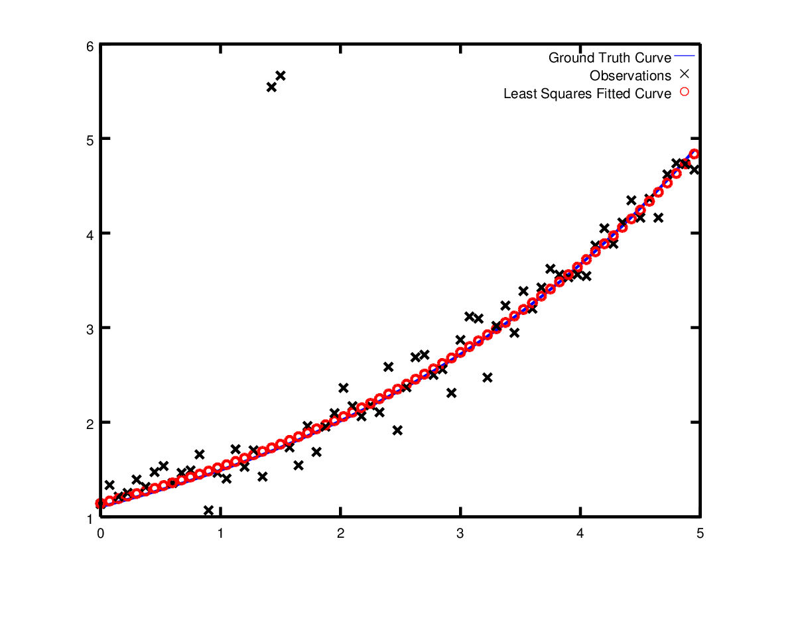

.. highlight:: c++

.. default-domain:: cpp

.. _chapter-nnls_tutorial:

========================
Non-linear Least Squares
========================

Introduction
============

Ceres can solve bounds constrained robustified non-linear least
squares problems of the form

.. math:: :label: ceresproblem

   \min_{\mathbf{x}} &\quad \frac{1}{2}\sum_{i} \rho_i\left(\left\|f_i\left(x_{i_1}, ... ,x_{i_k}\right)\right\|^2\right) \\
   \text{s.t.} &\quad l_j \le x_j \le u_j

Problems of this form comes up in a broad range of areas across
science and engineering - from `fitting curves`_ in statistics, to
constructing `3D models from photographs`_ in computer vision.

.. _fitting curves: http://en.wikipedia.org/wiki/Nonlinear_regression
.. _3D models from photographs: http://en.wikipedia.org/wiki/Bundle_adjustment

In this chapter we will learn how to solve :eq:`ceresproblem` using
Ceres Solver. Full working code for all the examples described in this
chapter and more can be found in the `examples
<https://ceres-solver.googlesource.com/ceres-solver/+/master/examples/>`_
directory.

The expression
:math:`\rho_i\left(\left\|f_i\left(x_{i_1},...,x_{i_k}\right)\right\|^2\right)`
is known as a ``ResidualBlock``, where :math:`f_i(\cdot)` is a
:class:`CostFunction` that depends on the parameter blocks
:math:`\left[x_{i_1},... , x_{i_k}\right]`. In most optimization
problems small groups of scalars occur together. For example the three
components of a translation vector and the four components of the
quaternion that define the pose of a camera. We refer to such a group
of small scalars as a ``ParameterBlock``. Of course a
``ParameterBlock`` can just be a single parameter. :math:`l_j` and
:math:`u_j` are bounds on the parameter block :math:`x_j`.

:math:`\rho_i` is a :class:`LossFunction`. A :class:`LossFunction` is
a scalar function that is used to reduce the influence of outliers on
the solution of non-linear least squares problems.

As a special case, when :math:`\rho_i(x) = x`, i.e., the identity
function, and :math:`l_j = -\infty` and :math:`u_j = \infty` we get
the more familiar `non-linear least squares problem
<http://en.wikipedia.org/wiki/Non-linear_least_squares>`_.

.. math:: \frac{1}{2}\sum_{i} \left\|f_i\left(x_{i_1}, ... ,x_{i_k}\right)\right\|^2.
   :label: ceresproblem2

.. _section-hello-world:

Hello World!
============

To get started, consider the problem of finding the minimum of the
function

.. math:: \frac{1}{2}(10 -x)^2.

This is a trivial problem, whose minimum is located at :math:`x = 10`,
but it is a good place to start to illustrate the basics of solving a
problem with Ceres [#f1]_.

The first step is to write a functor that will evaluate this the
function :math:`f(x) = 10 - x`:

.. code-block:: c++

   struct CostFunctor {
      template <typename T>
      bool operator()(const T* const x, T* residual) const {
        residual[0] = T(10.0) - x[0];
        return true;
      }
   };

The important thing to note here is that ``operator()`` is a templated
method, which assumes that all its inputs and outputs are of some type
``T``. The use of templating here allows Ceres to call
``CostFunctor::operator<T>()``, with ``T=double`` when just the value
of the residual is needed, and with a special type ``T=Jet`` when the
Jacobians are needed. In :ref:`section-derivatives` we will discuss the
various ways of supplying derivatives to Ceres in more detail.

Once we have a way of computing the residual function, it is now time
to construct a non-linear least squares problem using it and have
Ceres solve it.

.. code-block:: c++

   int main(int argc, char** argv) {
     google::InitGoogleLogging(argv[0]);

     // The variable to solve for with its initial value.
     double initial_x = 5.0;
     double x = initial_x;

     // Build the problem.
     Problem problem;

     // Set up the only cost function (also known as residual). This uses
     // auto-differentiation to obtain the derivative (jacobian).
     CostFunction* cost_function =
         new AutoDiffCostFunction<CostFunctor, 1, 1>(new CostFunctor);
     problem.AddResidualBlock(cost_function, NULL, &x);

     // Run the solver!
     Solver::Options options;
     options.linear_solver_type = ceres::DENSE_QR;
     options.minimizer_progress_to_stdout = true;
     Solver::Summary summary;
     Solve(options, &problem, &summary);

     std::cout << summary.BriefReport() << "\n";
     std::cout << "x : " << initial_x
               << " -> " << x << "\n";
     return 0;
   }

:class:`AutoDiffCostFunction` takes a ``CostFunctor`` as input,
automatically differentiates it and gives it a :class:`CostFunction`
interface.

Compiling and running `examples/helloworld.cc
<https://ceres-solver.googlesource.com/ceres-solver/+/master/examples/helloworld.cc>`_
gives us

.. code-block:: bash

   iter      cost      cost_change  |gradient|   |step|    tr_ratio  tr_radius  ls_iter  iter_time  total_time
      0  4.512500e+01    0.00e+00    9.50e+00   0.00e+00   0.00e+00  1.00e+04       0    5.33e-04    3.46e-03
      1  4.511598e-07    4.51e+01    9.50e-04   9.50e+00   1.00e+00  3.00e+04       1    5.00e-04    4.05e-03
      2  5.012552e-16    4.51e-07    3.17e-08   9.50e-04   1.00e+00  9.00e+04       1    1.60e-05    4.09e-03
   Ceres Solver Report: Iterations: 2, Initial cost: 4.512500e+01, Final cost: 5.012552e-16, Termination: CONVERGENCE
   x : 0.5 -> 10

Starting from a :math:`x=5`, the solver in two iterations goes to 10
[#f2]_. The careful reader will note that this is a linear problem and
one linear solve should be enough to get the optimal value.  The
default configuration of the solver is aimed at non-linear problems,
and for reasons of simplicity we did not change it in this example. It
is indeed possible to obtain the solution to this problem using Ceres
in one iteration. Also note that the solver did get very close to the
optimal function value of 0 in the very first iteration. We will
discuss these issues in greater detail when we talk about convergence
and parameter settings for Ceres.

.. rubric:: Footnotes

.. [#f1] `examples/helloworld.cc
   <https://ceres-solver.googlesource.com/ceres-solver/+/master/examples/helloworld.cc>`_
.. [#f2] Actually the solver ran for three iterations, and it was
   by looking at the value returned by the linear solver in the third
   iteration, it observed that the update to the parameter block was too
   small and declared convergence. Ceres only prints out the display at
   the end of an iteration, and terminates as soon as it detects
   convergence, which is why you only see two iterations here and not
   three.

.. _section-derivatives:

Derivatives
===========

Ceres Solver like most optimization packages, depends on being able to
evaluate the value and the derivatives of each term in the objective
function at arbitrary parameter values. Doing so correctly and
efficiently is essential to getting good results.  Ceres Solver
provides a number of ways of doing so. You have already seen one of
them in action --
Automatic Differentiation in `examples/helloworld.cc
<https://ceres-solver.googlesource.com/ceres-solver/+/master/examples/helloworld.cc>`_

We now consider the other two possibilities. Analytic and numeric
derivatives.

Numeric Derivatives
-------------------

In some cases, its not possible to define a templated cost functor,
for example when the evaluation of the residual involves a call to a
library function that you do not have control over.  In such a
situation, numerical differentiation can be used. The user defines a
functor which computes the residual value and construct a
:class:`NumericDiffCostFunction` using it. e.g., for :math:`f(x) = 10 - x`
the corresponding functor would be

.. code-block:: c++

  struct NumericDiffCostFunctor {
    bool operator()(const double* const x, double* residual) const {
      residual[0] = 10.0 - x[0];
      return true;
    }
  };

Which is added to the :class:`Problem` as:

.. code-block:: c++

  CostFunction* cost_function =
    new NumericDiffCostFunction<NumericDiffCostFunctor, ceres::CENTRAL, 1, 1, 1>(
        new NumericDiffCostFunctor)
  problem.AddResidualBlock(cost_function, NULL, &x);

Notice the parallel from when we were using automatic differentiation

.. code-block:: c++

  CostFunction* cost_function =
      new AutoDiffCostFunction<CostFunctor, 1, 1>(new CostFunctor);
  problem.AddResidualBlock(cost_function, NULL, &x);

The construction looks almost identical to the one used for automatic
differentiation, except for an extra template parameter that indicates
the kind of finite differencing scheme to be used for computing the
numerical derivatives [#f3]_. For more details see the documentation
for :class:`NumericDiffCostFunction`.

**Generally speaking we recommend automatic differentiation instead of
numeric differentiation. The use of C++ templates makes automatic
differentiation efficient, whereas numeric differentiation is
expensive, prone to numeric errors, and leads to slower convergence.**

Analytic Derivatives
--------------------

In some cases, using automatic differentiation is not possible. For
example, it may be the case that it is more efficient to compute the
derivatives in closed form instead of relying on the chain rule used
by the automatic differentiation code.

In such cases, it is possible to supply your own residual and jacobian
computation code. To do this, define a subclass of
:class:`CostFunction` or :class:`SizedCostFunction` if you know the
sizes of the parameters and residuals at compile time. Here for
example is ``SimpleCostFunction`` that implements :math:`f(x) = 10 -
x`.

.. code-block:: c++

  class QuadraticCostFunction : public ceres::SizedCostFunction<1, 1> {
   public:
    virtual ~QuadraticCostFunction() {}
    virtual bool Evaluate(double const* const* parameters,
                          double* residuals,
                          double** jacobians) const {
      const double x = parameters[0][0];
      residuals[0] = 10 - x;

      // Compute the Jacobian if asked for.
      if (jacobians != NULL && jacobians[0] != NULL) {
        jacobians[0][0] = -1;
      }
      return true;
    }
  };

``SimpleCostFunction::Evaluate`` is provided with an input array of
``parameters``, an output array ``residuals`` for residuals and an
output array ``jacobians`` for Jacobians. The ``jacobians`` array is
optional, ``Evaluate`` is expected to check when it is non-null, and
if it is the case then fill it with the values of the derivative of
the residual function. In this case since the residual function is
linear, the Jacobian is constant [#f4]_ .

As can be seen from the above code fragments, implementing
:class:`CostFunction` objects is a bit tedious. We recommend that
unless you have a good reason to manage the jacobian computation
yourself, you use :class:`AutoDiffCostFunction` or
:class:`NumericDiffCostFunction` to construct your residual blocks.

More About Derivatives
----------------------

Computing derivatives is by far the most complicated part of using
Ceres, and depending on the circumstance the user may need more
sophisticated ways of computing derivatives. This section just
scratches the surface of how derivatives can be supplied to
Ceres. Once you are comfortable with using
:class:`NumericDiffCostFunction` and :class:`AutoDiffCostFunction` we
recommend taking a look at :class:`DynamicAutoDiffCostFunction`,
:class:`CostFunctionToFunctor`, :class:`NumericDiffFunctor` and
:class:`ConditionedCostFunction` for more advanced ways of
constructing and computing cost functions.

.. rubric:: Footnotes

.. [#f3] `examples/helloworld_numeric_diff.cc
   <https://ceres-solver.googlesource.com/ceres-solver/+/master/examples/helloworld_numeric_diff.cc>`_.
.. [#f4] `examples/helloworld_analytic_diff.cc
   <https://ceres-solver.googlesource.com/ceres-solver/+/master/examples/helloworld_analytic_diff.cc>`_.

.. _section-powell:

Powell's Function
=================

Consider now a slightly more complicated example -- the minimization
of Powell's function. Let :math:`x = \left[x_1, x_2, x_3, x_4 \right]`
and

.. math::

  \begin{align}
     f_1(x) &= x_1 + 10x_2 \\
     f_2(x) &= \sqrt{5}  (x_3 - x_4)\\
     f_3(x) &= (x_2 - 2x_3)^2\\
     f_4(x) &= \sqrt{10}  (x_1 - x_4)^2\\
       F(x) &= \left[f_1(x),\ f_2(x),\ f_3(x),\ f_4(x) \right]
  \end{align}

:math:`F(x)` is a function of four parameters, has four residuals
and we wish to find :math:`x` such that :math:`\frac{1}{2}\|F(x)\|^2`
is minimized.

Again, the first step is to define functors that evaluate of the terms
in the objective functor. Here is the code for evaluating
:math:`f_4(x_1, x_4)`:

.. code-block:: c++

 struct F4 {
   template <typename T>
   bool operator()(const T* const x1, const T* const x4, T* residual) const {
     residual[0] = T(sqrt(10.0)) * (x1[0] - x4[0]) * (x1[0] - x4[0]);
     return true;
   }
 };

Similarly, we can define classes ``F1``, ``F2`` and ``F3`` to evaluate
:math:`f_1(x_1, x_2)`, :math:`f_2(x_3, x_4)` and :math:`f_3(x_2, x_3)`
respectively. Using these, the problem can be constructed as follows:

.. code-block:: c++

  double x1 =  3.0; double x2 = -1.0; double x3 =  0.0; double x4 = 1.0;

  Problem problem;

  // Add residual terms to the problem using the using the autodiff
  // wrapper to get the derivatives automatically.
  problem.AddResidualBlock(
    new AutoDiffCostFunction<F1, 1, 1, 1>(new F1), NULL, &x1, &x2);
  problem.AddResidualBlock(
    new AutoDiffCostFunction<F2, 1, 1, 1>(new F2), NULL, &x3, &x4);
  problem.AddResidualBlock(
    new AutoDiffCostFunction<F3, 1, 1, 1>(new F3), NULL, &x2, &x3)
  problem.AddResidualBlock(
    new AutoDiffCostFunction<F4, 1, 1, 1>(new F4), NULL, &x1, &x4);

Note that each ``ResidualBlock`` only depends on the two parameters
that the corresponding residual object depends on and not on all four
parameters. Compiling and running `examples/powell.cc
<https://ceres-solver.googlesource.com/ceres-solver/+/master/examples/powell.cc>`_
gives us:

.. code-block:: bash

    Initial x1 = 3, x2 = -1, x3 = 0, x4 = 1
    iter      cost      cost_change  |gradient|   |step|    tr_ratio  tr_radius  ls_iter  iter_time  total_time
       0  1.075000e+02    0.00e+00    1.55e+02   0.00e+00   0.00e+00  1.00e+04       0    4.95e-04    2.30e-03
       1  5.036190e+00    1.02e+02    2.00e+01   2.16e+00   9.53e-01  3.00e+04       1    4.39e-05    2.40e-03
       2  3.148168e-01    4.72e+00    2.50e+00   6.23e-01   9.37e-01  9.00e+04       1    9.06e-06    2.43e-03
       3  1.967760e-02    2.95e-01    3.13e-01   3.08e-01   9.37e-01  2.70e+05       1    8.11e-06    2.45e-03
       4  1.229900e-03    1.84e-02    3.91e-02   1.54e-01   9.37e-01  8.10e+05       1    6.91e-06    2.48e-03
       5  7.687123e-05    1.15e-03    4.89e-03   7.69e-02   9.37e-01  2.43e+06       1    7.87e-06    2.50e-03
       6  4.804625e-06    7.21e-05    6.11e-04   3.85e-02   9.37e-01  7.29e+06       1    5.96e-06    2.52e-03
       7  3.003028e-07    4.50e-06    7.64e-05   1.92e-02   9.37e-01  2.19e+07       1    5.96e-06    2.55e-03
       8  1.877006e-08    2.82e-07    9.54e-06   9.62e-03   9.37e-01  6.56e+07       1    5.96e-06    2.57e-03
       9  1.173223e-09    1.76e-08    1.19e-06   4.81e-03   9.37e-01  1.97e+08       1    7.87e-06    2.60e-03
      10  7.333425e-11    1.10e-09    1.49e-07   2.40e-03   9.37e-01  5.90e+08       1    6.20e-06    2.63e-03
      11  4.584044e-12    6.88e-11    1.86e-08   1.20e-03   9.37e-01  1.77e+09       1    6.91e-06    2.65e-03
      12  2.865573e-13    4.30e-12    2.33e-09   6.02e-04   9.37e-01  5.31e+09       1    5.96e-06    2.67e-03
      13  1.791438e-14    2.69e-13    2.91e-10   3.01e-04   9.37e-01  1.59e+10       1    7.15e-06    2.69e-03

    Ceres Solver v1.10.0 Solve Report
    ----------------------------------
                                         Original                  Reduced
    Parameter blocks                            4                        4
    Parameters                                  4                        4
    Residual blocks                             4                        4
    Residual                                    4                        4

    Minimizer                        TRUST_REGION

    Dense linear algebra library            EIGEN
    Trust region strategy     LEVENBERG_MARQUARDT

                                            Given                     Used
    Linear solver                        DENSE_QR                 DENSE_QR
    Threads                                     1                        1
    Linear solver threads                       1                        1

    Cost:
    Initial                          1.075000e+02
    Final                            1.791438e-14
    Change                           1.075000e+02

    Minimizer iterations                       14
    Successful steps                           14
    Unsuccessful steps                          0

    Time (in seconds):
    Preprocessor                            0.002

      Residual evaluation                   0.000
      Jacobian evaluation                   0.000
      Linear solver                         0.000
    Minimizer                               0.001

    Postprocessor                           0.000
    Total                                   0.005

    Termination:                      CONVERGENCE (Gradient tolerance reached. Gradient max norm: 3.642190e-11 <= 1.000000e-10)

    Final x1 = 0.000292189, x2 = -2.92189e-05, x3 = 4.79511e-05, x4 = 4.79511e-05

It is easy to see that the optimal solution to this problem is at
:math:`x_1=0, x_2=0, x_3=0, x_4=0` with an objective function value of
:math:`0`. In 10 iterations, Ceres finds a solution with an objective
function value of :math:`4\times 10^{-12}`.

.. rubric:: Footnotes

.. [#f5] `examples/powell.cc
   <https://ceres-solver.googlesource.com/ceres-solver/+/master/examples/powell.cc>`_.

.. _section-fitting:

Curve Fitting
=============

The examples we have seen until now are simple optimization problems
with no data. The original purpose of least squares and non-linear
least squares analysis was fitting curves to data. It is only
appropriate that we now consider an example of such a problem
[#f6]_. It contains data generated by sampling the curve :math:`y =
e^{0.3x + 0.1}` and adding Gaussian noise with standard deviation
:math:`\sigma = 0.2`. Let us fit some data to the curve

.. math::  y = e^{mx + c}.

We begin by defining a templated object to evaluate the
residual. There will be a residual for each observation.

.. code-block:: c++

 struct ExponentialResidual {
   ExponentialResidual(double x, double y)
       : x_(x), y_(y) {}

   template <typename T>
   bool operator()(const T* const m, const T* const c, T* residual) const {
     residual[0] = T(y_) - exp(m[0] * T(x_) + c[0]);
     return true;
   }

  private:
   // Observations for a sample.
   const double x_;
   const double y_;
 };

Assuming the observations are in a :math:`2n` sized array called
``data`` the problem construction is a simple matter of creating a
:class:`CostFunction` for every observation.

.. code-block:: c++

 double m = 0.0;
 double c = 0.0;

 Problem problem;
 for (int i = 0; i < kNumObservations; ++i) {
   CostFunction* cost_function =
        new AutoDiffCostFunction<ExponentialResidual, 1, 1, 1>(
            new ExponentialResidual(data[2 * i], data[2 * i + 1]));
   problem.AddResidualBlock(cost_function, NULL, &m, &c);
 }

Compiling and running `examples/curve_fitting.cc
<https://ceres-solver.googlesource.com/ceres-solver/+/master/examples/curve_fitting.cc>`_
gives us:

.. code-block:: bash

    iter      cost      cost_change  |gradient|   |step|    tr_ratio  tr_radius  ls_iter  iter_time  total_time
       0  1.211734e+02    0.00e+00    3.61e+02   0.00e+00   0.00e+00  1.00e+04       0    5.34e-04    2.56e-03
       1  1.211734e+02   -2.21e+03    0.00e+00   7.52e-01  -1.87e+01  5.00e+03       1    4.29e-05    3.25e-03
       2  1.211734e+02   -2.21e+03    0.00e+00   7.51e-01  -1.86e+01  1.25e+03       1    1.10e-05    3.28e-03
       3  1.211734e+02   -2.19e+03    0.00e+00   7.48e-01  -1.85e+01  1.56e+02       1    1.41e-05    3.31e-03
       4  1.211734e+02   -2.02e+03    0.00e+00   7.22e-01  -1.70e+01  9.77e+00       1    1.00e-05    3.34e-03
       5  1.211734e+02   -7.34e+02    0.00e+00   5.78e-01  -6.32e+00  3.05e-01       1    1.00e-05    3.36e-03
       6  3.306595e+01    8.81e+01    4.10e+02   3.18e-01   1.37e+00  9.16e-01       1    2.79e-05    3.41e-03
       7  6.426770e+00    2.66e+01    1.81e+02   1.29e-01   1.10e+00  2.75e+00       1    2.10e-05    3.45e-03
       8  3.344546e+00    3.08e+00    5.51e+01   3.05e-02   1.03e+00  8.24e+00       1    2.10e-05    3.48e-03
       9  1.987485e+00    1.36e+00    2.33e+01   8.87e-02   9.94e-01  2.47e+01       1    2.10e-05    3.52e-03
      10  1.211585e+00    7.76e-01    8.22e+00   1.05e-01   9.89e-01  7.42e+01       1    2.10e-05    3.56e-03
      11  1.063265e+00    1.48e-01    1.44e+00   6.06e-02   9.97e-01  2.22e+02       1    2.60e-05    3.61e-03
      12  1.056795e+00    6.47e-03    1.18e-01   1.47e-02   1.00e+00  6.67e+02       1    2.10e-05    3.64e-03
      13  1.056751e+00    4.39e-05    3.79e-03   1.28e-03   1.00e+00  2.00e+03       1    2.10e-05    3.68e-03
    Ceres Solver Report: Iterations: 13, Initial cost: 1.211734e+02, Final cost: 1.056751e+00, Termination: CONVERGENCE
    Initial m: 0 c: 0
    Final   m: 0.291861 c: 0.131439

Starting from parameter values :math:`m = 0, c=0` with an initial
objective function value of :math:`121.173` Ceres finds a solution
:math:`m= 0.291861, c = 0.131439` with an objective function value of
:math:`1.05675`. These values are a bit different than the
parameters of the original model :math:`m=0.3, c= 0.1`, but this is
expected. When reconstructing a curve from noisy data, we expect to
see such deviations. Indeed, if you were to evaluate the objective
function for :math:`m=0.3, c=0.1`, the fit is worse with an objective
function value of :math:`1.082425`.  The figure below illustrates the fit.

   Least squares curve fitting.

.. rubric:: Footnotes

.. [#f6] `examples/curve_fitting.cc
   <https://ceres-solver.googlesource.com/ceres-solver/+/master/examples/curve_fitting.cc>`_

Robust Curve Fitting
=====================

Now suppose the data we are given has some outliers, i.e., we have
some points that do not obey the noise model. If we were to use the
code above to fit such data, we would get a fit that looks as
below. Notice how the fitted curve deviates from the ground truth.

.. figure:: non_robust_least_squares_fit.png
   :figwidth: 500px
   :height: 400px
   :align: center

To deal with outliers, a standard technique is to use a
:class:`LossFunction`. Loss functions reduce the influence of
residual blocks with high residuals, usually the ones corresponding to
outliers. To associate a loss function with a residual block, we change

.. code-block:: c++

   problem.AddResidualBlock(cost_function, NULL , &m, &c);

to

.. code-block:: c++

   problem.AddResidualBlock(cost_function, new CauchyLoss(0.5) , &m, &c);

:class:`CauchyLoss` is one of the loss functions that ships with Ceres
Solver. The argument :math:`0.5` specifies the scale of the loss
function. As a result, we get the fit below [#f7]_. Notice how the
fitted curve moves back closer to the ground truth curve.

.. figure:: robust_least_squares_fit.png
   :figwidth: 500px
   :height: 400px
   :align: center

   Using :class:`LossFunction` to reduce the effect of outliers on a
   least squares fit.

.. rubric:: Footnotes

.. [#f7] `examples/robust_curve_fitting.cc
   <https://ceres-solver.googlesource.com/ceres-solver/+/master/examples/robust_curve_fitting.cc>`_

Bundle Adjustment
=================

One of the main reasons for writing Ceres was our need to solve large
scale bundle adjustment problems [HartleyZisserman]_, [Triggs]_.

Given a set of measured image feature locations and correspondences,
the goal of bundle adjustment is to find 3D point positions and camera
parameters that minimize the reprojection error. This optimization
problem is usually formulated as a non-linear least squares problem,
where the error is the squared :math:`L_2` norm of the difference between
the observed feature location and the projection of the corresponding
3D point on the image plane of the camera. Ceres has extensive support
for solving bundle adjustment problems.

Let us solve a problem from the `BAL
<http://grail.cs.washington.edu/projects/bal/>`_ dataset [#f8]_.

The first step as usual is to define a templated functor that computes
the reprojection error/residual. The structure of the functor is
similar to the ``ExponentialResidual``, in that there is an
instance of this object responsible for each image observation.

Each residual in a BAL problem depends on a three dimensional point
and a nine parameter camera. The nine parameters defining the camera
are: three for rotation as a Rodriques' axis-angle vector, three
for translation, one for focal length and two for radial distortion.
The details of this camera model can be found the `Bundler homepage
<http://phototour.cs.washington.edu/bundler/>`_ and the `BAL homepage
<http://grail.cs.washington.edu/projects/bal/>`_.

.. code-block:: c++

 struct SnavelyReprojectionError {
   SnavelyReprojectionError(double observed_x, double observed_y)
       : observed_x(observed_x), observed_y(observed_y) {}

   template <typename T>
   bool operator()(const T* const camera,
                   const T* const point,
                   T* residuals) const {
     // camera[0,1,2] are the angle-axis rotation.
     T p[3];
     ceres::AngleAxisRotatePoint(camera, point, p);
     // camera[3,4,5] are the translation.
     p[0] += camera[3]; p[1] += camera[4]; p[2] += camera[5];

     // Compute the center of distortion. The sign change comes from
     // the camera model that Noah Snavely's Bundler assumes, whereby
     // the camera coordinate system has a negative z axis.
     T xp = - p[0] / p[2];
     T yp = - p[1] / p[2];

     // Apply second and fourth order radial distortion.
     const T& l1 = camera[7];
     const T& l2 = camera[8];
     T r2 = xp*xp + yp*yp;
     T distortion = T(1.0) + r2  * (l1 + l2  * r2);

     // Compute final projected point position.
     const T& focal = camera[6];
     T predicted_x = focal * distortion * xp;
     T predicted_y = focal * distortion * yp;

     // The error is the difference between the predicted and observed position.
     residuals[0] = predicted_x - T(observed_x);
     residuals[1] = predicted_y - T(observed_y);
     return true;
   }

    // Factory to hide the construction of the CostFunction object from
    // the client code.
    static ceres::CostFunction* Create(const double observed_x,
                                       const double observed_y) {
      return (new ceres::AutoDiffCostFunction<SnavelyReprojectionError, 2, 9, 3>(
                  new SnavelyReprojectionError(observed_x, observed_y)));
    }

   double observed_x;
   double observed_y;
 };

Note that unlike the examples before, this is a non-trivial function
and computing its analytic Jacobian is a bit of a pain. Automatic
differentiation makes life much simpler. The function
:func:`AngleAxisRotatePoint` and other functions for manipulating
rotations can be found in ``include/ceres/rotation.h``.

Given this functor, the bundle adjustment problem can be constructed
as follows:

.. code-block:: c++

 ceres::Problem problem;
 for (int i = 0; i < bal_problem.num_observations(); ++i) {
   ceres::CostFunction* cost_function =
       SnavelyReprojectionError::Create(
            bal_problem.observations()[2 * i + 0],
            bal_problem.observations()[2 * i + 1]);
   problem.AddResidualBlock(cost_function,
                            NULL /* squared loss */,
                            bal_problem.mutable_camera_for_observation(i),
                            bal_problem.mutable_point_for_observation(i));
 }

Notice that the problem construction for bundle adjustment is very
similar to the curve fitting example -- one term is added to the
objective function per observation.

Since this large sparse problem (well large for ``DENSE_QR`` anyways),
one way to solve this problem is to set
:member:`Solver::Options::linear_solver_type` to
``SPARSE_NORMAL_CHOLESKY`` and call :member:`Solve`. And while this is
a reasonable thing to do, bundle adjustment problems have a special
sparsity structure that can be exploited to solve them much more
efficiently. Ceres provides three specialized solvers (collectively
known as Schur-based solvers) for this task. The example code uses the
simplest of them ``DENSE_SCHUR``.

.. code-block:: c++

 ceres::Solver::Options options;
 options.linear_solver_type = ceres::DENSE_SCHUR;
 options.minimizer_progress_to_stdout = true;
 ceres::Solver::Summary summary;
 ceres::Solve(options, &problem, &summary);
 std::cout << summary.FullReport() << "\n";

For a more sophisticated bundle adjustment example which demonstrates
the use of Ceres' more advanced features including its various linear
solvers, robust loss functions and local parameterizations see
`examples/bundle_adjuster.cc
<https://ceres-solver.googlesource.com/ceres-solver/+/master/examples/bundle_adjuster.cc>`_

.. rubric:: Footnotes

.. [#f8] `examples/simple_bundle_adjuster.cc
   <https://ceres-solver.googlesource.com/ceres-solver/+/master/examples/simple_bundle_adjuster.cc>`_

Other Examples
==============

Besides the examples in this chapter, the  `example
<https://ceres-solver.googlesource.com/ceres-solver/+/master/examples/>`_
directory contains a number of other examples:

#. `bundle_adjuster.cc
   <https://ceres-solver.googlesource.com/ceres-solver/+/master/examples/bundle_adjuster.cc>`_
   shows how to use the various features of Ceres to solve bundle
   adjustment problems.

#. `circle_fit.cc
   <https://ceres-solver.googlesource.com/ceres-solver/+/master/examples/circle_fit.cc>`_
   shows how to fit data to a circle.

#. `ellipse_approximation.cc
   <https://ceres-solver.googlesource.com/ceres-solver/+/master/examples/ellipse_approximation.cc>`_
   fits points randomly distributed on an ellipse with an approximate
   line segment contour. This is done by jointly optimizing the
   control points of the line segment contour along with the preimage
   positions for the data points. The purpose of this example is to
   show an example use case for ``Solver::Options::dynamic_sparsity``,
   and how it can benefit problems which are numerically dense but
   dynamically sparse.

#. `denoising.cc
   <https://ceres-solver.googlesource.com/ceres-solver/+/master/examples/denoising.cc>`_
   implements image denoising using the `Fields of Experts
   <http://www.gris.informatik.tu-darmstadt.de/~sroth/research/foe/index.html>`_
   model.

#. `nist.cc
   <https://ceres-solver.googlesource.com/ceres-solver/+/master/examples/nist.cc>`_
   implements and attempts to solves the `NIST
   <http://www.itl.nist.gov/div898/strd/nls/nls_main.shtm>`_
   non-linear regression problems.

#. `nist.cc
   <https://ceres-solver.googlesource.com/ceres-solver/+/master/examples/nist.cc>`_
   implements and attempts to solves the `NIST
   <http://www.itl.nist.gov/div898/strd/nls/nls_main.shtm>`_
   non-linear regression problems.

#. `more_garbow_hillstrom.cc
   <https://ceres-solver.googlesource.com/ceres-solver/+/master/examples/more_garbow_hillstrom.cc>`_
   A subset of the test problems from the paper

   Testing Unconstrained Optimization Software
   Jorge J. More, Burton S. Garbow and Kenneth E. Hillstrom
   ACM Transactions on Mathematical Software, 7(1), pp. 17-41, 1981

   which were augmented with bounds and used for testing bounds
   constrained optimization algorithms by

   A Trust Region Approach to Linearly Constrained Optimization
   David M. Gay
   Numerical Analysis (Griffiths, D.F., ed.), pp. 72-105
   Lecture Notes in Mathematics 1066, Springer Verlag, 1984.

#. `libmv_bundle_adjuster.cc
   <https://ceres-solver.googlesource.com/ceres-solver/+/master/examples/libmv_bundle_adjuster.cc>`_
   is the bundle adjustment algorithm used by `Blender <www.blender.org>`_/libmv.

#. `libmv_homography.cc
   <https://ceres-solver.googlesource.com/ceres-solver/+/master/examples/libmv_homography.cc>`_
   This file demonstrates solving for a homography between two sets of
   points and using a custom exit criterion by having a callback check
   for image-space error.

#. `robot_pose_mle.cc
   <https://ceres-solver.googlesource.com/ceres-solver/+/master/examples/robot_pose_mle.cc>`_
   This example demonstrates how to use the ``DynamicAutoDiffCostFunction``
   variant of CostFunction. The ``DynamicAutoDiffCostFunction`` is meant to
   be used in cases where the number of parameter blocks or the sizes are not
   known at compile time.

   This example simulates a robot traversing down a 1-dimension hallway with
   noise odometry readings and noisy range readings of the end of the hallway.
   By fusing the noisy odometry and sensor readings this example demonstrates
   how to compute the maximum likelihood estimate (MLE) of the robot's pose at
   each timestep.
