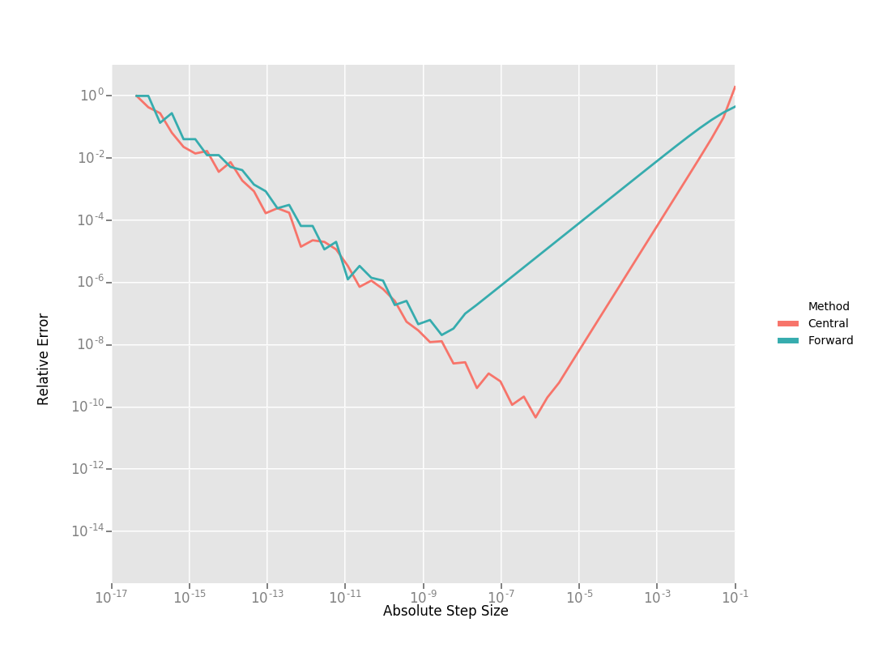
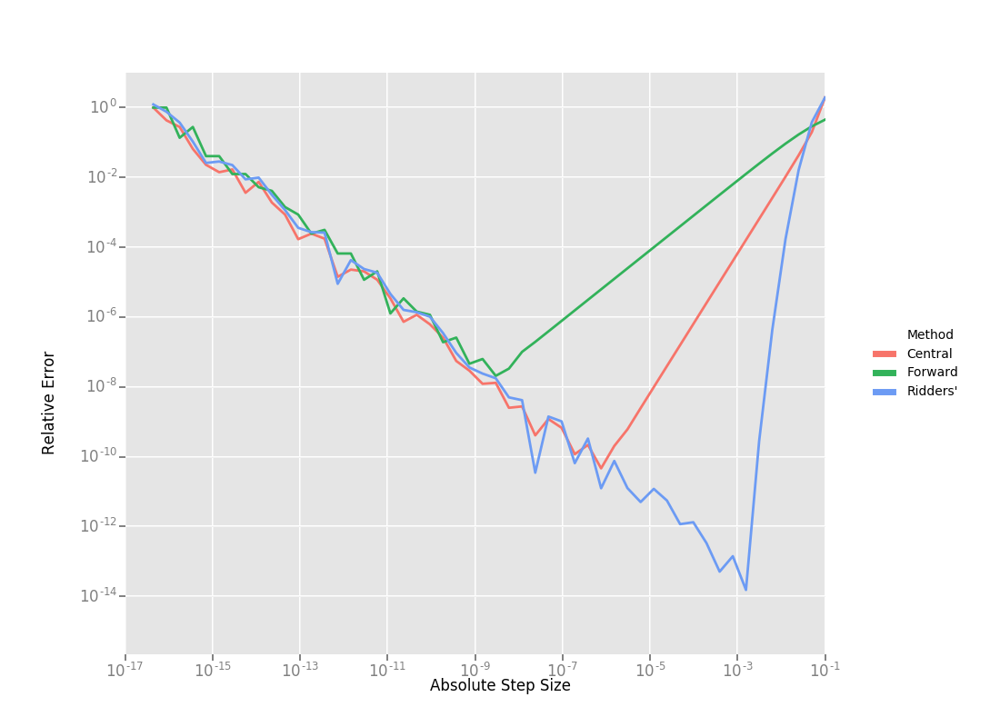

.. default-domain:: cpp

.. cpp:namespace:: ceres

.. _chapter-numerical_derivatives:

===================
Numeric derivatives
===================

The other extreme from using analytic derivatives is to use numeric
derivatives. The key observation here is that the process of
differentiating a function :math:`f(x)` w.r.t :math:`x` can be written
as the limiting process:

.. math::
   Df(x) = \lim_{h \rightarrow 0} \frac{f(x + h) - f(x)}{h}

Forward Differences
===================

Now of course one cannot perform the limiting operation numerically on
a computer so we do the next best thing, which is to choose a small
value of :math:`h` and approximate the derivative as

.. math::
   Df(x) \approx \frac{f(x + h) - f(x)}{h}

The above formula is the simplest most basic form of numeric
differentiation. It is known as the *Forward Difference* formula.

So how would one go about constructing a numerically differentiated
version of ``Rat43Analytic`` (`Rat43
<http://www.itl.nist.gov/div898/strd/nls/data/ratkowsky3.shtml>`_) in
Ceres Solver. This is done in two steps:

  1. Define *Functor* that given the parameter values will evaluate the
     residual for a given :math:`(x,y)`.
  2. Construct a :class:`CostFunction` by using
     :class:`NumericDiffCostFunction` to wrap an instance of
     ``Rat43CostFunctor``.

.. code-block:: c++

  struct Rat43CostFunctor {
    Rat43CostFunctor(const double x, const double y) : x_(x), y_(y) {}

    bool operator()(const double* parameters, double* residuals) const {
      const double b1 = parameters[0];
      const double b2 = parameters[1];
      const double b3 = parameters[2];
      const double b4 = parameters[3];
      residuals[0] = b1 * pow(1.0 + exp(b2 -  b3 * x_), -1.0 / b4) - y_;
      return true;
    }

    const double x_;
    const double y_;
  }

  CostFunction* cost_function =
    new NumericDiffCostFunction<Rat43CostFunctor, FORWARD, 1, 4>(
      new Rat43CostFunctor(x, y));

This is about the minimum amount of work one can expect to do to
define the cost function. The only thing that the user needs to do is
to make sure that the evaluation of the residual is implemented
correctly and efficiently.

Before going further, it is instructive to get an estimate of the
error in the forward difference formula. We do this by considering the
`Taylor expansion <https://en.wikipedia.org/wiki/Taylor_series>`_ of
:math:`f` near :math:`x`.

.. math::
   \begin{align}
   f(x+h) &= f(x) + h Df(x) + \frac{h^2}{2!} D^2f(x) +
   \frac{h^3}{3!}D^3f(x) + \cdots \\
   Df(x) &= \frac{f(x + h) - f(x)}{h} - \left [\frac{h}{2!}D^2f(x) +
   \frac{h^2}{3!}D^3f(x) + \cdots  \right]\\
   Df(x) &= \frac{f(x + h) - f(x)}{h} + O(h)
   \end{align}

i.e., the error in the forward difference formula is
:math:`O(h)` [#f4]_.

Implementation Details
----------------------

:class:`NumericDiffCostFunction` implements a generic algorithm to
numerically differentiate a given functor. While the actual
implementation of :class:`NumericDiffCostFunction` is complicated, the
net result is a :class:`CostFunction` that roughly looks something
like the following:

.. code-block:: c++

  class Rat43NumericDiffForward : public SizedCostFunction<1,4> {
     public:
       Rat43NumericDiffForward(const Rat43Functor* functor) : functor_(functor) {}
       virtual ~Rat43NumericDiffForward() {}
       virtual bool Evaluate(double const* const* parameters,
                             double* residuals,
			     double** jacobians) const {
 	 functor_(parameters[0], residuals);
	 if (!jacobians) return true;
	 double* jacobian = jacobians[0];
	 if (!jacobian) return true;

	 const double f = residuals[0];
	 double parameters_plus_h[4];
	 for (int i = 0; i < 4; ++i) {
	   std::copy(parameters, parameters + 4, parameters_plus_h);
	   const double kRelativeStepSize = 1e-6;
	   const double h = std::abs(parameters[i]) * kRelativeStepSize;
	   parameters_plus_h[i] += h;
           double f_plus;
  	   functor_(parameters_plus_h, &f_plus);
	   jacobian[i] = (f_plus - f) / h;
         }
	 return true;
       }

     private:
       scoped_ptr<Rat43Functor> functor_;
   };

Note the choice of step size :math:`h` in the above code, instead of
an absolute step size which is the same for all parameters, we use a
relative step size of :math:`\text{kRelativeStepSize} = 10^{-6}`. This
gives better derivative estimates than an absolute step size [#f2]_
[#f3]_. This choice of step size only works for parameter values that
are not close to zero. So the actual implementation of
:class:`NumericDiffCostFunction`, uses a more complex step size
selection logic, where close to zero, it switches to a fixed step
size.

Central Differences
===================

:math:`O(h)` error in the Forward Difference formula is okay but not
great. A better method is to use the *Central Difference* formula:

.. math::
   Df(x) \approx \frac{f(x + h) - f(x - h)}{2h}

Notice that if the value of :math:`f(x)` is known, the Forward
Difference formula only requires one extra evaluation, but the Central
Difference formula requires two evaluations, making it twice as
expensive. So is the extra evaluation worth it?

To answer this question, we again compute the error of approximation
in the central difference formula:

.. math::
   \begin{align}
  f(x + h) &= f(x) + h Df(x) + \frac{h^2}{2!}
  D^2f(x) + \frac{h^3}{3!} D^3f(x) + \frac{h^4}{4!} D^4f(x) + \cdots\\
    f(x - h) &= f(x) - h Df(x) + \frac{h^2}{2!}
  D^2f(x) - \frac{h^3}{3!} D^3f(c_2) + \frac{h^4}{4!} D^4f(x) +
  \cdots\\
  Df(x) & =  \frac{f(x + h) - f(x - h)}{2h} + \frac{h^2}{3!}
  D^3f(x) +  \frac{h^4}{5!}
  D^5f(x) + \cdots \\
  Df(x) & =  \frac{f(x + h) - f(x - h)}{2h} + O(h^2)
   \end{align}

The error of the Central Difference formula is :math:`O(h^2)`, i.e.,
the error goes down quadratically whereas the error in the Forward
Difference formula only goes down linearly.

Using central differences instead of forward differences in Ceres
Solver is a simple matter of changing a template argument to
:class:`NumericDiffCostFunction` as follows:

.. code-block:: c++

  CostFunction* cost_function =
    new NumericDiffCostFunction<Rat43CostFunctor, CENTRAL, 1, 4>(
      new Rat43CostFunctor(x, y));

But what do these differences in the error mean in practice? To see
this, consider the problem of evaluating the derivative of the
univariate function

.. math::
   f(x) = \frac{e^x}{\sin x - x^2},

at :math:`x = 1.0`.

It is easy to determine that :math:`Df(1.0) =
140.73773557129658`. Using this value as reference, we can now compute
the relative error in the forward and central difference formulae as a
function of the absolute step size and plot them.

Reading the graph from right to left, a number of things stand out in
the above graph:

 1. The graph for both formulae have two distinct regions. At first,
    starting from a large value of :math:`h` the error goes down as
    the effect of truncating the Taylor series dominates, but as the
    value of :math:`h` continues to decrease, the error starts
    increasing again as roundoff error starts to dominate the
    computation. So we cannot just keep on reducing the value of
    :math:`h` to get better estimates of :math:`Df`. The fact that we
    are using finite precision arithmetic becomes a limiting factor.
 2. Forward Difference formula is not a great method for evaluating
    derivatives. Central Difference formula converges much more
    quickly to a more accurate estimate of the derivative with
    decreasing step size. So unless the evaluation of :math:`f(x)` is
    so expensive that you absolutely cannot afford the extra
    evaluation required by central differences, **do not use the
    Forward Difference formula**.
 3. Neither formula works well for a poorly chosen value of :math:`h`.

Ridders' Method
===============

So, can we get better estimates of :math:`Df` without requiring such
small values of :math:`h` that we start hitting floating point
roundoff errors?

One possible approach is to find a method whose error goes down faster
than :math:`O(h^2)`. This can be done by applying `Richardson
Extrapolation
<https://en.wikipedia.org/wiki/Richardson_extrapolation>`_ to the
problem of differentiation. This is also known as *Ridders' Method*
[Ridders]_.

Let us recall, the error in the central differences formula.

.. math::
   \begin{align}
   Df(x) & =  \frac{f(x + h) - f(x - h)}{2h} + \frac{h^2}{3!}
   D^3f(x) +  \frac{h^4}{5!}
   D^5f(x) + \cdots\\
           & =  \frac{f(x + h) - f(x - h)}{2h} + K_2 h^2 + K_4 h^4 + \cdots
   \end{align}

The key thing to note here is that the terms :math:`K_2, K_4, ...`
are indepdendent of :math:`h` and only depend on :math:`x`.

Let us now define:

.. math::

   A(1, m) = \frac{f(x + h/2^{m-1}) - f(x - h/2^{m-1})}{2h/2^{m-1}}.

Then observe that

.. math::

   Df(x) = A(1,1) + K_2 h^2 + K_4 h^4 + \cdots

and

.. math::

   Df(x) = A(1, 2) + K_2 (h/2)^2 + K_4 (h/2)^4 + \cdots

Here we have halved the step size to obtain a second central
differences estimate of :math:`Df(x)`. Combining these two estimates,
we get:

.. math::

   Df(x) = \frac{4 A(1, 2) - A(1,1)}{4 - 1} + O(h^4)

which is an approximation of :math:`Df(x)` with truncation error that
goes down as :math:`O(h^4)`. But we do not have to stop here. We can
iterate this process to obtain even more accurate estimates as
follows:

.. math::

   A(n, m) =  \begin{cases}
    \frac{\displaystyle f(x + h/2^{m-1}) - f(x -
    h/2^{m-1})}{\displaystyle 2h/2^{m-1}} & n = 1 \\
   \frac{\displaystyle 4^{n-1} A(n - 1, m + 1) - A(n - 1, m)}{\displaystyle 4^{n-1} - 1} & n > 1
   \end{cases}

It is straightforward to show that the approximation error in
:math:`A(n, 1)` is :math:`O(h^{2n})`. To see how the above formula can
be implemented in practice to compute :math:`A(n,1)` it is helpful to
structure the computation as the following tableau:

.. math::
   \begin{array}{ccccc}
   A(1,1) & A(1, 2) & A(1, 3) & A(1, 4) & \cdots\\
          & A(2, 1) & A(2, 2) & A(2, 3) & \cdots\\
	  &         & A(3, 1) & A(3, 2) & \cdots\\
	  &         &         & A(4, 1) & \cdots \\
	  &         &         &         & \ddots
   \end{array}

So, to compute :math:`A(n, 1)` for increasing values of :math:`n` we
move from the left to the right, computing one column at a
time. Assuming that the primary cost here is the evaluation of the
function :math:`f(x)`, the cost of computing a new column of the above
tableau is two function evaluations. Since the cost of evaluating
:math:`A(1, n)`, requires evaluating the central difference formula
for step size of :math:`2^{1-n}h`

Applying this method to :math:`f(x) = \frac{e^x}{\sin x - x^2}`
starting with a fairly large step size :math:`h = 0.01`, we get:

.. math::
   \begin{array}{rrrrr}
   141.678097131 &140.971663667 &140.796145400 &140.752333523 &140.741384778\\
   &140.736185846 &140.737639311 &140.737729564 &140.737735196\\
   & &140.737736209 &140.737735581 &140.737735571\\
   & & &140.737735571 &140.737735571\\
   & & & &140.737735571\\
   \end{array}

Compared to the *correct* value :math:`Df(1.0) = 140.73773557129658`,
:math:`A(5, 1)` has a relative error of :math:`10^{-13}`. For
comparison, the relative error for the central difference formula with
the same stepsize (:math:`0.01/2^4 = 0.000625`) is :math:`10^{-5}`.

The above tableau is the basis of Ridders' method for numeric
differentiation. The full implementation is an adaptive scheme that
tracks its own estimation error and stops automatically when the
desired precision is reached. Of course it is more expensive than the
forward and central difference formulae, but is also significantly
more robust and accurate.

Using Ridder's method instead of forward or central differences in
Ceres is again a simple matter of changing a template argument to
:class:`NumericDiffCostFunction` as follows:

.. code-block:: c++

  CostFunction* cost_function =
    new NumericDiffCostFunction<Rat43CostFunctor, RIDDERS, 1, 4>(
      new Rat43CostFunctor(x, y));

The following graph shows the relative error of the three methods as a
function of the absolute step size. For Ridders's method we assume
that the step size for evaluating :math:`A(n,1)` is :math:`2^{1-n}h`.

Using the 10 function evaluations that are needed to compute
:math:`A(5,1)` we are able to approximate :math:`Df(1.0)` about a 1000
times better than the best central differences estimate. To put these
numbers in perspective, machine epsilon for double precision
arithmetic is :math:`\approx 2.22 \times 10^{-16}`.

Going back to ``Rat43``, let us also look at the runtime cost of the
various methods for computing numeric derivatives.

==========================   =========
CostFunction                 Time (ns)
==========================   =========
Rat43Analytic                      255
Rat43AnalyticOptimized              92
Rat43NumericDiffForward            262
Rat43NumericDiffCentral            517
Rat43NumericDiffRidders           3760
==========================   =========

As expected, Central Differences is about twice as expensive as
Forward Differences and the remarkable accuracy improvements of
Ridders' method cost an order of magnitude more runtime.

Recommendations
===============

Numeric differentiation should be used when you cannot compute the
derivatives either analytically or using automatic differention. This
is usually the case when you are calling an external library or
function whose analytic form you do not know or even if you do, you
are not in a position to re-write it in a manner required to use
:ref:`chapter-automatic_derivatives`.

When using numeric differentiation, use at least Central Differences,
and if execution time is not a concern or the objective function is
such that determining a good static relative step size is hard,
Ridders' method is recommended.

.. rubric:: Footnotes

.. [#f2] `Numerical Differentiation
	 <https://en.wikipedia.org/wiki/Numerical_differentiation#Practical_considerations_using_floating_point_arithmetic>`_
.. [#f3] [Press]_ Numerical Recipes, Section 5.7
.. [#f4] In asymptotic error analysis, an error of :math:`O(h^k)`
	 means that the absolute-value of the error is at most some
	 constant times :math:`h^k` when :math:`h` is close enough to
	 :math:`0`.
